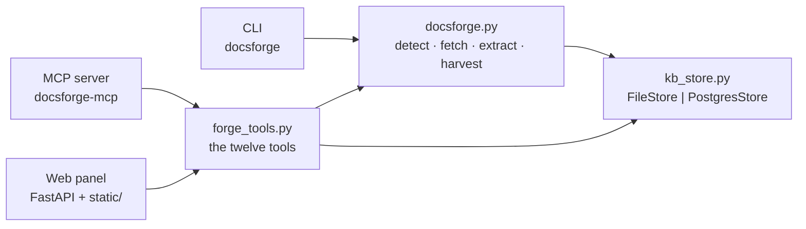
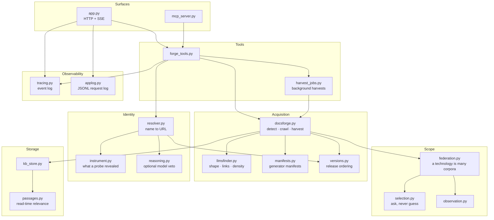
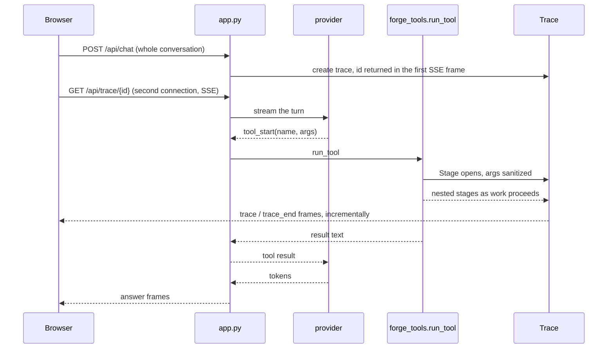
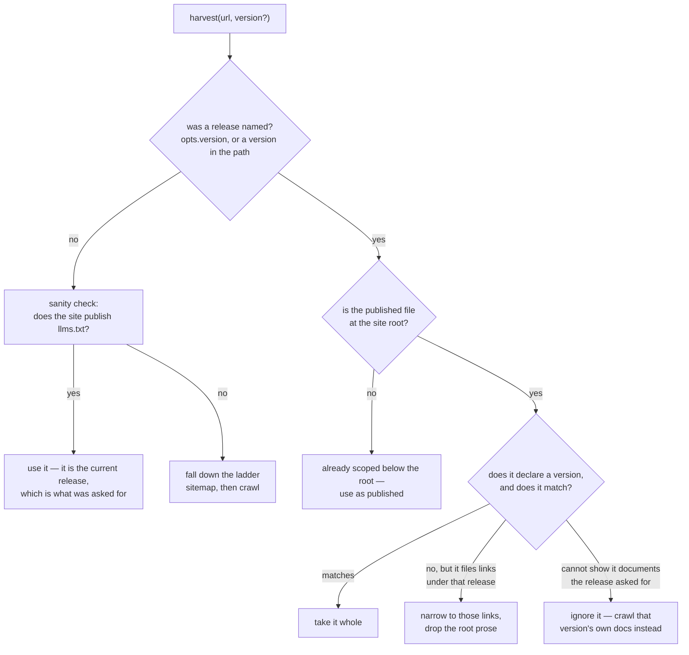
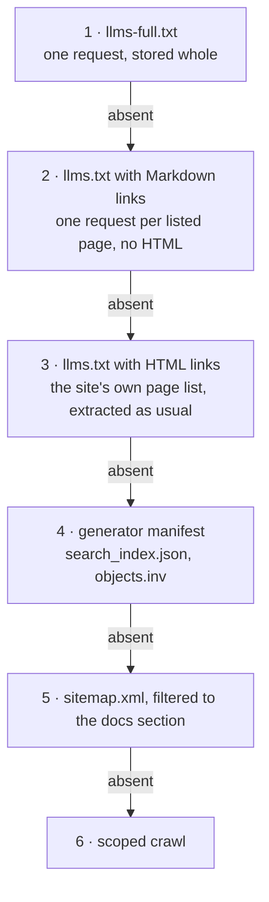
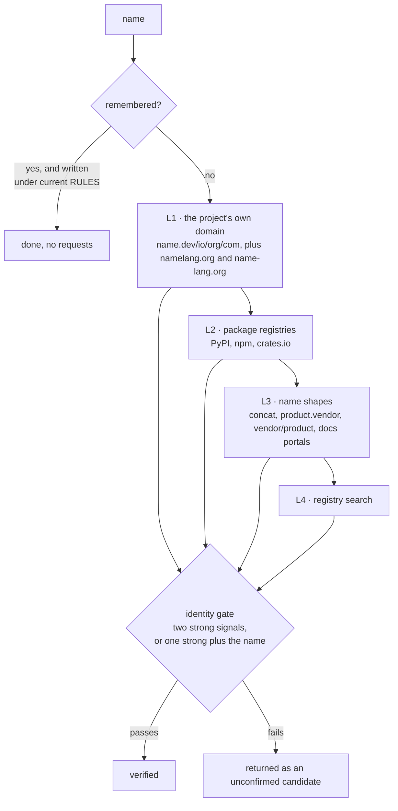
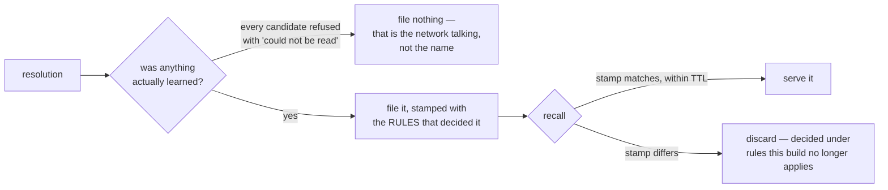
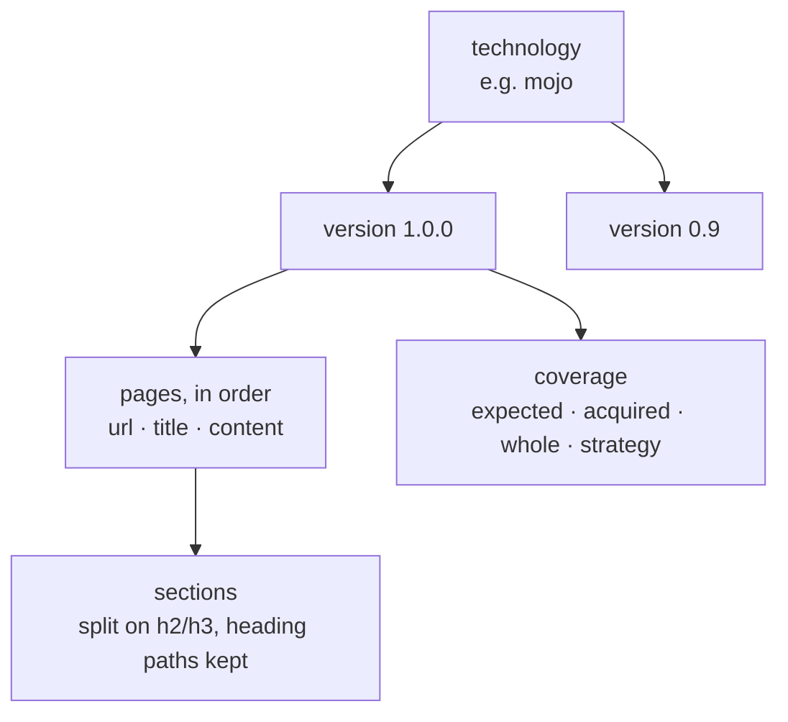
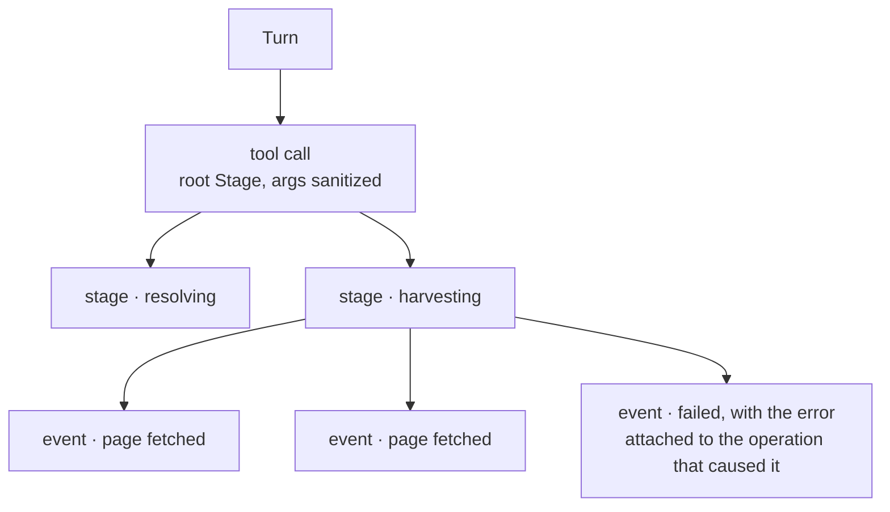

# Architecture

Recorded from the build, not from intention. Where the code and this file
disagree, the code is right and this file is stale.

Written against 740 passing tests, 59 skipped behind opt-in gates — live
network, Postgres, browser rendering.

---

## 1. One engine, three surfaces

The extraction engine is a library. Nothing about it knows whether a CLI, an
MCP client or a browser is asking, which is what keeps the three from drifting
apart — an MCP client and the chat panel return byte-identical results because
they call the same function with the same arguments.

`forge_tools.py` is the seam. It owns argument shaping, the trace wrapper, and
the human-readable result strings; `docsforge.py` owns the web and knows
nothing about tools.

---

## 2. Module map

`measure.py` sits outside this — it is a bench harness, not a runtime path.

---

## 3. A chat turn, end to end

The server is stateless. The browser holds the conversation and posts it back
every turn, so a reload loses nothing the browser still has and the server
never has to reconcile two ideas of the same chat.

Two connections, deliberately. The answer stream and the trace stream have
different lifetimes: a harvest that outlives the 25-second deadline keeps
emitting trace events long after the answer has been handed back, so binding
them to one connection would either truncate the trace or hold the answer
hostage to it.

`run_tool` therefore **detaches** rather than closes a trace whose work moved
to a background thread. Closing it on return raced `harvest_jobs` and cut the
event log off mid-harvest.

---

## 4. Two pathways into a harvest

This is the shape of the whole acquisition problem, and the distinction the
system gets wrong most easily.

`llms.txt` and `llms-full.txt` are published for the **current** release. A
site publishes one of them, at its origin, describing what it ships today.
That makes them the best possible answer to "give me the latest docs" and a
poor answer to "give me 0.9" — so the request decides the pathway, not the
file.

Three details that were each a defect before they were a rule:

- **Never broaden a scoped request.** `docs.modular.com` publishes one
  `llms.txt` for Modular Cloud, so a request for `/mojo/` came back as API-key
  and billing documentation. No release was involved — just a file about a
  different product on the same host.
- **Narrowing for a release drops the root prose; narrowing for a section keeps
  it.** The file's own prose belongs to the release it was published for. When
  the reason for narrowing is a *section*, the file already showed it covers
  that section and its overview is the same site's words about it. Conflating
  the two threw away 1.1 MB of real documentation on mojolang.org.
- **Where the file sits decides this, not how we got its URL.** The gate used
  to also require that *we* had probed for the file, on the reasoning that a
  URL the caller typed is a URL the caller meant. The caller stopped typing
  it — resolution now hands `learn_technology` whatever it found — and asking
  for Mojo 0.9 went straight past the release check.

---

## 5. The acquisition ladder

Tried in order, stopping at the first rung that answers. The ladder's claim is
that more laps never mean a lower bar.

**A file the site published about itself outranks anything inferred about it.**
A sitemap is a hint addressed to crawlers; `llms.txt` is a statement addressed
to us.

**An index is not documentation.** A file of 229 links is a table of contents.
Storing it *as* the corpus is the failure the README warns about, so shape is
classified by link density before anything is stored: an index is almost
entirely link characters, a dump almost entirely prose, and a hybrid is
treated as both — store the prose, follow the links, count both separately.

Every rung on this ladder now pays the same politeness. `_crawl_html` has
spaced its requests per host since the beginning; the manifest path ignored
`opts.delay` outright and sent 211 back-to-back requests at mojolang.org,
which is how a small documentation host learns to refuse us.

### Coverage is three separate claims

Root acquisition, manifest acquisition and corpus completeness are recorded
apart, because one succeeding says nothing about the others.

| Claim | Means |
|---|---|
| `expected` | unique **actionable** pages the manifest lists — not its raw link count |
| `acquired` | how many of those came back |
| `whole` | `acquired == expected`, and never true of a partial corpus |
| `failed_urls` | each failure with a normalized URL and a coarse category, so a retry can operate on the failed subset |

`expected` is measured against what the site says exists, not against the slice
a page limit left behind — otherwise cutting a harvest short would make it
*look* complete.

---

## 6. Name resolution

The hard part is not finding a candidate. It is refusing a plausible wrong one:
a harvest of the wrong project, stamped `verified`, is worse than no harvest,
because the caller has been given a reason to stop checking.

The whole ladder is capped at 40 requests.

**Strong signals** identify a project rather than describe one: `own-domain`,
`docs-host`, `install:`, `repo-backlink`, `registry-agreement`,
`repo-identity`. Mention counts are deliberately excluded — corroboration,
never proof.

Three rules the gate learned the hard way:

- **A code host is nobody's own domain.** `mojo.dev` redirects onto
  `github.com/gdejohn/procrastination`, a Java library — Maven plugins are also
  called "mojos". Crediting the arrival made that a *verified* answer for Mojo,
  off two structural signals and not one mention of the name.
- **A language owns its `lang` domain.** Names that are common words take the
  suffix for exactly that reason. Nothing probed them, so the highest-signal
  source never saw the site: `zig` resolved to an npm templating library and
  `nim` to an unrelated repository.
- **Asked must be a prefix of found.** Asking for `2` is answered by `2.11`;
  asking for `2.5` is **not** answered by `2`. A loose comparison is how a
  request for one release gets handed another's documentation.

### The cache is evidence, and evidence goes stale

Both halves were written after being burned. A NAT64 outage refused every
candidate as a "private address"; six were found, none could be read, and the
refusal was cached for seven days while the cause was fixed within one. Later
the *wrong* answer was filed as a success, where a 30-day TTL would have
outlived its own fix by four weeks.

---

## 7. Storage

Two versions of one library are kept side by side rather than one overwriting
the other, because they contradict each other. `versions.py` orders labels so
"latest" means newest rather than most recently fetched — a release number
always outranks a harvest date, because the date only ever appears when a
harvest failed to find a number.

Two backends behind one protocol:

| | `FileStore` | `PostgresStore` |
|---|---|---|
| Default | yes, zero keys | set `DOCSFORGE_DB` |
| Search | substring | full-text, ranked |
| Pages | Markdown files | rows, with `page.search` and `section.search` |

Pages stream into a `.partial` file that no reader can see; the finished file
is assembled at settle time. A crash leaves the `.partial` on disk rather than
a half-written corpus that looks whole.

The storage chip in the UI names which backend answered, because Postgres ranks
search and a folder of files cannot — hiding which one you are reading would be
a lie about the quality of the answer.

---

## 8. Observability

Two independent records, for two different readers.

**`tracing.py`** is what the user sees: a nested, incrementally emitted event
log rendered under each tool row in the panel, expandable by clicking the row.
Every event carries an id, a parent id, a lifecycle state — `queued`,
`running`, `completed`, `failed`, `skipped`, `cancelled` — a timestamp, and
optional input, result and error.

Design constraints that are load-bearing:

- **Events are keyed by id, not appended.** A stage re-emitted with the same id
  updates in place, so 230 progress ticks are one row that counts up rather
  than 230 rows.
- **Emission is incremental, never buffered to the end.** A harvest that takes
  three minutes is watchable for three minutes.
- **No fabricated percentages.** A percentage is shown only where the backend
  has a defensible denominator — a manifest length is one; a crawl frontier is
  not.
- **Sanitized at the boundary**, with strings clipped at 4,000 characters and
  outputs at 20,000, and the omission stated rather than silent.
- Low-level events are **not** persisted into chat history. The trace explains a
  turn while you are looking at it; the durable record of a harvest is the
  knowledge-base entry it wrote.

**`applog.py`** is what a developer reads: rotating JSONL at `logs/docsforge.log`
— one line per HTTP request, one per tool call, per turn, per trace event, per
error. Gitignored, and independent of whether a browser was watching.

---

## 9. Boundaries

- **Fetches to private, loopback, link-local and reserved addresses are
  refused**, with NAT64-mapped addresses unwrapped before the check —
  `64:ff9b::/96` is a public address wearing an IPv6 costume, and refusing it
  broke every harvest on a NAT64 network.
- `save_docs` cannot write outside its output root.
- Rendered Markdown is sanitized with `nh3`, because it mixes model output with
  scraped HTML.
- Tool results are capped at 60,000 characters with an explicit truncation
  marker.
- JS rendering is opt-in and slow; crawling is bounded by a per-host delay, a
  per-host concurrency cap, and a page cap.

---

## 10. What this architecture refuses

- **Guessing a URL for a name it could not confirm.** An unconfirmed resolution
  returns its candidates and says why each failed.
- **Reporting coverage it did not measure.** `complete`, `incomplete` and
  `unknown` are distinct, and `unknown` is never rendered as success.
- **Restructuring what a publisher wrote.** A document published whole is
  stored whole. Read-time relevance narrows what is handed back; ingestion
  never reshapes what was published.
- **Letting one dead page end a run.** Partial failure is an operating
  condition, recorded per URL, not an exception.
