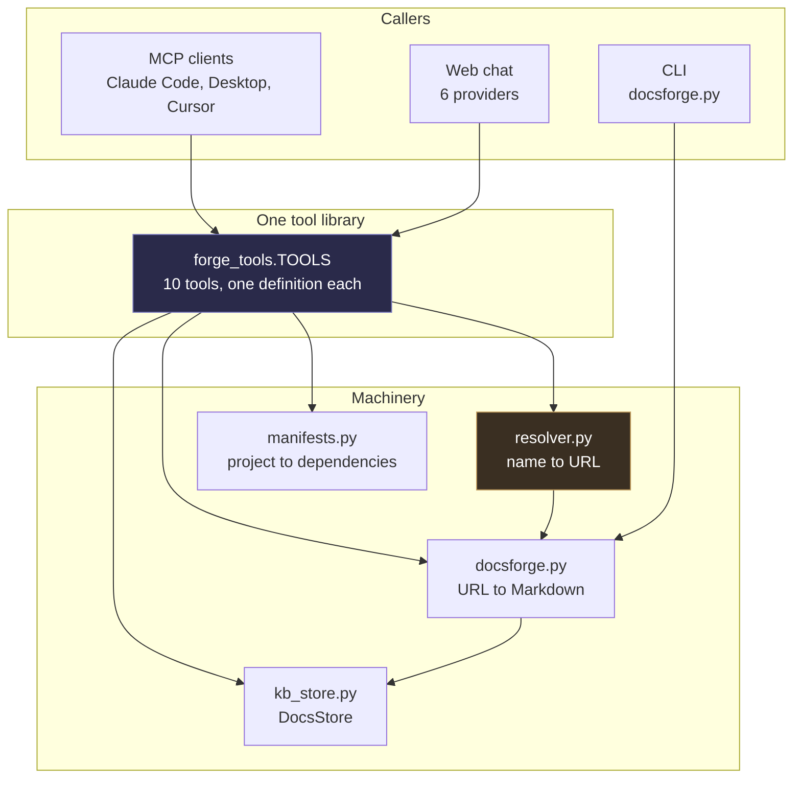
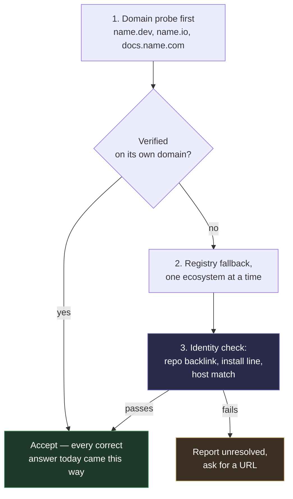

# DocsForge — audit

**Method:** every number in this document was executed, not read off the source.

This is a two-pass document.

| | | |
|---|---|---|
| **Pass 1** | 17 August, re-verified 20 August against `5b320df` | found nine failures — §1–§5 |
| **Pass 2** | 20 August, against `316c7f2` | measured what the fixes did — §7 |

**Sections 1 to 5 are left as they were written.** They are the record of what
was true before anything was changed, and rewriting them into the past tense
would destroy the evidence the fixes were built from. Read them as *as-found*.
Section 6 says what was done about each, section 7 measures the result.

> **One diagnosis in pass 1 was wrong and has been corrected in place.** F9's
> cause is not that the harvester cannot tell an `llms.txt` index from a full
> dump — it can, and does. See F9 for what actually happens. Two tables were
> also completed with measurements previously marked "not measured", and the
> recoverable total turned out far larger than first reported.

### Status at a glance

| | Finding | Status |
|---|---|---|
| F1 | verification confirms the name, not the project | ✅ **fixed** — triangulated identity |
| F2 | candidate ranking crosses ecosystems | ✅ **fixed** — install-line ecosystem check |
| F3 | an 80-byte stub outranks the real docs root | ✅ **fixed** — content floor + redirect following |
| F4 | the forge guard is exact-host | ✅ **fixed** — suffix match |
| F5 | `latest` means most-recently-harvested | ✅ **fixed** — `versions.py` |
| F6 | multi-word technologies do not resolve | ⬜ **open** — still an honest failure |
| F7 | `learn_technology` blocks for minutes | ⬜ **open** — the largest remaining defect |
| F8 | the Postgres backend is unexercised by default | ✅ **fixed** — CI stands one up |
| F9 | an `llms.txt` index is stored as documentation | ✅ **fixed** — sibling probe + page splitting |
| F10 | the chat prompt orders the model to list the store first | ✅ **fixed** — see §9 |
| F11 | a marketing homepage is accepted when the docs root renders client-side | ✅ **fixed** — §9 |
| F12 | a homepage harvest scopes to the whole host and returns the blog | ✅ **fixed** — §9 |
| F13 | a multi-locale sitemap returns an arbitrary language | ✅ **fixed** — §9 |
| F14 | a harvest could never be removed; the store only grew | ✅ **fixed** — §10 |

**The code is fixed. The stored corpus is not yet** — the seven affected
technologies were harvested before the fix and still hold their indexes, and
`astro` holds 194 blog pages. That is stale data rather than a live defect, and
clearing it is now a supported operation rather than a wish: see §7.3.

---

## Verdict in one paragraph

**As found:** the pipeline from a URL to stored, searchable, versioned
documentation was solid — well built, well tested, doing real work (703 pages of
Effect, 109 of Pydantic across two versions, ranked full-text search returning
genuinely relevant snippets). The weakness was not that DocsForge failed; it was
that **it failed confidently, and labelled the failures as checked.** Of eight
technologies resolved live, three landed on the wrong project and **all three
were marked `verified`**. Separately, seven stored technologies held a table of
contents rather than documentation — 0.81% of the text actually available, 19
million characters missing — and every one was marked `complete`. The
verification and completeness signals that existed precisely to prevent silent
wrong answers were the signals that were wrong.

**After the fixes:** resolution is 7 of 8 with nothing wrong and nothing wrongly
verified; the same seven technologies now fetch 19.1 million characters instead
of 155 thousand; and completeness is computed from a count, with `unknown` as a
distinct answer, so unearned confidence is no longer expressible. Two defects
remain and both announce themselves: harvests still block past MCP client
timeouts, and multi-word names still fail to resolve out loud. §7 has the
measurements.

---

## 1. What DocsForge is

A standalone MCP server that gives any AI model documentation for technology it
was never trained on. A model hits an unfamiliar import, calls DocsForge with
the name, and gets back real documentation harvested from the real site — rather
than reconstructing something from stale training data.

Ten tools, one library, three surfaces:



`mcp_server.py` does not define tools. It **generates** them from
`forge_tools.TOOLS` by translating each JSON Schema into a synthesised Python
signature the SDK can read. That is worth keeping: the two surfaces previously
drifted badly — four tools existed in the library and simply were not exposed
over MCP, and `max_pages` was declared `ge=1, le=200` in the MCP copy while the
harvester treats `0` as unlimited, so no MCP client could request a full
harvest. Twelve tests in `test_mcp.py` now hold the generated surface against
its source.

**Verified today:** `python mcp_server.py --list` prints all ten tools.

---

## 2. What works

### 2.1 URL → Markdown (`docsforge.py`, 1,059 lines)

The oldest and strongest part. `detect_source()` picks a strategy, then a
handler renders to Markdown:

| Strategy | Trigger | Notes |
|---|---|---|
| `llms_txt` | a published `llms.txt` | The site describing itself for machines — nothing beats it |
| `openapi` | OpenAPI/Swagger JSON or YAML | Renders operations, parameters, schemas as tables |
| `sitemap` | `sitemap.xml`, nested sitemaps followed | Bounded recursion |
| `github` | a repository URL | README + `docs/` |
| `raw_text` | plain text | |
| `html` | fallback | Crawls same-host links inside a scope |

Two details that matter more than they look:

- **`docs_scope()`** pins a crawl to the documentation root. Without it a crawl
  starting at an Effect docs page swallowed `/podcast`, and the model
  summarised a podcast feed as though it were the library. This is the single
  most valuable function in the file.
- **Version labelling is verified, not assumed.** `harvest()` reads a version
  from the URL path, then checks the pages actually came back carrying it, and
  falls back to a harvest date if not. This was added because Pydantic 2.11 and
  1.10 harvested **byte-identical** — both had silently been served the
  site-wide `llms.txt`. A store that cheerfully files two different versions of
  the same bytes is worse than one with no versions at all.

**Verified today:** 57 harvest tests + 43 core tests pass.

### 2.2 DocsStore (`kb_store.py`, 716 lines)

Three levels — **technology → version → page** — behind one `Store` protocol
with two implementations.

| | Postgres | Files |
|---|---|---|
| Search | `websearch_to_tsquery` + `ts_rank`, GIN index on a generated `tsvector` | substring, unranked |
| Snippets | `ts_headline` with `«…»` markers | none |
| Bulk load | `COPY … FROM STDIN` | file write |
| Role | production | fallback |

The fallback is not decorative. A slow-starting database used to make DocsStore
appear permanently empty, because the file store was chosen once at boot and
cached forever. It now records `wanted_dsn` and retries Postgres after 15
seconds, so a database that arrives late is picked up rather than ignored for
the life of the process.

**Verified today**, against the live database:

```
18 technologies stored
  effect     703 pages   6,322,993 chars   v3
  pydantic   109 pages   1,414,402 chars   1.10 + 2.11
  16 others    1 page each   (see F9 — seven of these are indexes, not docs)
```

Ranked search, run live for `"retry policy"`:

```
- effect v3 · page 19: Retrying
    …how to define **retry** **policies** using schedules, which dictate when…
- effect v3 · page 123: Effect vs fp-ts
- effect v3 · page 43:  Examples
```

Correct ranking, correct highlighting, sub-second. This part works.

### 2.3 Project manifests (`manifests.py`, 226 lines)

Parses `package.json`, `pyproject.toml` (PEP 621 *and* Poetry),
`requirements.txt`, `Cargo.toml`, `go.mod`. Bounded walk, `node_modules` and
friends skipped, nothing imported or evaluated — manifests are read as data.

**Verified today:** `scan_project(".")` on this repository listed all 19
dependencies with pinned versions and correctly identified `pydantic` as the
one already stored.

### 2.4 Name normalisation

`normalise()` strips prose dressing — `Effect.ts`, `effect-ts` and `effect` all
reduce to `effect` — and `stored_name()` matches exact, then normalised, then
unique-prefix, refusing ambiguous prefixes rather than guessing. `learn_technology`
files under the canonical form, so calling it as `"Effect.ts"` after `"effect"`
finds the existing copy instead of re-crawling 703 pages into a duplicate.

**Verified previously end-to-end:** `learn_technology("valibot")` with no URL →
npm → `valibot.dev/llms.txt` → verified → harvested in 4s; a second call spelled
`"Valibot"` fetched nothing.

---

## 3. What does not work

*As found. Seven of these nine are now fixed — see §6 for what was done and §7
for the measurements. They are preserved here as written because the evidence
is what the fixes were built from.*

🔴 wrong answers delivered as correct · 🟠 real limitation, visible when it bites
· F1–F8 concern resolution and run roughly in damage order. **F9 was found last
and was the single highest-payoff fix on the list** — it is numbered last only
because the numbers are referenced elsewhere and renumbering would break them.

### F1 — Verification confirms the *name*, not the *project* 🔴

The whole safety argument for resolving by name rests on `verify()`. It fetches
the candidate and counts how many times the normalised name appears in the
stripped body; three or more and the candidate is `verified`.

That test cannot distinguish a project from an unrelated project with the same
name. Measured live:

| Asked for | Resolved to | `verified` | Reason given |
|---|---|---|---|
| `terraform` | `github.com/sintaxi/terraform#readme` | **true** | "names 'terraform' 4 times" |
| `kubernetes` | `github.com/kubernetes-client/python` | **true** | "names 'kubernetes' 5 times" |
| `htmx` | `docs.rs/htmx` | **true** | "names 'htmx' 8 times" |

None of these is the technology anyone means. HashiCorp Terraform is not
`sintaxi/terraform` (an unrelated static-site tool). Kubernetes is not its
Python client library. htmx is not a Rust crate. Every one passed.

**Why it fails:** a page about *any* project called X mentions X constantly.
Mention-counting measures topic, not identity.

**What would actually work** is checking identity signals the registry already
handed us: does the candidate page link back to the repository the registry
named? Does its install line name the same package in the same ecosystem
(`npm i htmx` vs `cargo add htmx`)? Is the host the project's own domain rather
than a code forge? Those distinguish projects. A word count does not.

### F2 — Candidate ranking crosses ecosystems 🔴

Candidates from every registry are pooled and sorted by confidence alone. A
`documentation` field scores 0.92 regardless of which registry it came from, so
for `htmx` the crates.io entry (0.92) outranked the npm homepage (0.55) — and
npm is where the real htmx lives. Same shape for `astro`, which tried a Rust
crate first.

The ecosystem is only corrected *after* a winner verifies, which is too late:
by then the wrong ecosystem has already won.

### F3 — The probe accepts empty pages, and this loses to marketing 🟠

For `astro`, the probe **found the correct documentation root** —
`https://docs.astro.build/` — and then verification rejected it, while the
marketing homepage `astro.build` won with 60 mentions.

Measured cause:

```
https://docs.astro.build/    80 bytes    3 chars of text    0 mentions
https://astro.build      40,000 bytes  6,448 chars of text  60 mentions
```

`docs.astro.build/` returns an 80-byte redirect shell. `probe_docs_root()`
accepts a candidate on HTTP 200 plus an HTML content-type and nothing else, so
an empty stub enters the pool at 0.70 confidence, fails verification, and hands
the win to the marketing page. The right answer was found and then discarded.

Needs a minimum-content floor and meta-refresh / client-redirect following.

### F4 — The forge guard is exact-host 🟠

`FORGES` is matched exactly, so subdomains slip past:

```
is_forge("https://gist.github.com/…")          -> False
is_forge("https://raw.githubusercontent.com/…") -> False
```

Live consequence: resolving `htmx` produced **`https://gist.github.com/llms.txt`
at 0.95 confidence** — the highest-scoring candidate of the entire run. It was
rejected only by luck, because GitHub's own `llms.txt` happens not to say
"htmx". Ask about a word GitHub's file does contain and it wins.

### F5 — `"latest"` means most-recently-harvested, not newest 🔴

Live, right now:

```
pydantic versions stored : 1.10 (24 pages), 2.11 (85 pages)
read_knowledge_base("pydantic")  ->  1.10
```

A model asking for Pydantic docs with no version gets **1.10** — because it was
harvested at 18:26 and 2.11 earlier. This repository's own `requirements.txt`
pins `pydantic>=2.0`.

This is exactly the contradiction the three-level versioned store was built to
prevent, reintroduced at the very last step. And `scan_project` reports
`pydantic … stored as **pydantic**` without noticing the mismatch:
`manifests.doc_versions()` exists and computes the right candidate labels, but
nothing calls it when deciding what to hand back.

### F6 — Multi-word technologies do not resolve 🟠

`cloudflare workers` → unresolved in 1.6s. No registry has that name, and there
is no other path. The failure is *honest* — it reports unresolved rather than
inventing something, which is the designed behaviour and the right one — but a
large class of real technologies (cloud platforms, databases, protocols,
anything with a space in its name) is simply unreachable.

### F7 — `learn_technology` blocks for minutes 🟠

A 703-page harvest takes roughly 12 minutes. The tool call blocks for all of it,
which exceeds typical MCP client timeouts. The most valuable tool in the product
is the one most likely to time out in the client that calls it.

### F8 — The Postgres backend is unexercised by default 🟠

All 22 skipped tests are Postgres, gated behind `DOCSFORGE_TEST_DB`:

```
284 passed, 22 skipped in 25.01s
```

The default run therefore tests the **fallback** store thoroughly and the
**production** store not at all. The Postgres path holds the schema migration,
the `tsvector` search, `ts_headline` snippets and the `COPY` bulk load — the
parts most likely to break and least likely to break visibly.

### F9 — The resolver's success disables the extractor's correct behaviour 🔴

Sixteen of eighteen technologies hold exactly one page. Some are legitimate —
`zod` is a single 266 KB `llms.txt` that really is the whole thing. But the
`llms.txt` convention has two shapes:

- a **full dump** — the documentation itself (zod, stripe, convex)
- an **index** — a short link list that names a fuller file alongside it

Seven of the sixteen single-page technologies stored the index.

**The first version of this audit blamed the harvester for not telling the two
apart. That was wrong.** `detect_source()` already prefers `llms-full.txt` — it
probes for it *first*, at `docsforge.py:301`. Measured today, the same site
resolves three different ways depending only on the URL it is handed:

```
detect_source("https://ai-sdk.dev/llms.txt")           -> https://ai-sdk.dev/llms.txt        (2 KB index)
detect_source("https://ai-sdk.dev")                    -> https://ai-sdk.dev/llms-full.txt   (5.7 MB)
detect_source("https://ai-sdk.dev/docs/introduction")  -> https://ai-sdk.dev/llms-full.txt   (5.7 MB)
```

Given the bare domain, DocsForge gets it right. It only fails when handed the
`llms.txt` URL directly — because `docsforge.py:280` returns immediately on any
URL ending in `llms.txt`, and the probe that would have found the full file sits
*below* that early return and never executes.

And handing over exactly that URL is what the resolver does. `DOC_PATHS` in
`resolver.py:38` begins with `/llms.txt`, and a hit becomes a candidate at
**0.95 — the highest confidence the resolver can assign.** So:

> **The resolver finding an `llms.txt` is the very thing that stops the
> extractor from looking for the full one.** Two components, each correct alone,
> wrong in combination.

Measured cost, every figure fetched today:

| Technology | Stored | Full file available | Captured |
|---|---|---|---|
| `ai-sdk` | 2,216 | **5,756,477** | 0.04% |
| `prisma` | 7,086 | **4,961,636** | 0.14% |
| `nuxt` | 56,614 | **4,451,427** | 1.27% |
| `railway` | 70,612 | **2,398,306** | 2.94% |
| `svelte` | 1,673 | **1,181,307** | 0.14% |
| `hono` | 5,649 | **369,248** | 1.53% |
| `tanstack` | 11,592 | 11,595 | 99.97% — no real loss |

**155,442 characters stored against 19,129,996 available: 0.81%.** The missing
18.97 million characters are **more than twice the entire rest of the store**
(8.42 M today). Fixing this one bug takes DocsForge from 8.4 M to roughly
27.4 M characters — it more than triples the corpus without harvesting a single
new technology.

Every one of these is marked `complete: True`. The stored file for `hono` reads,
in full sentences, *"[Full Docs](https://hono.dev/llms-full.txt) Full
documentation of Hono"* — the answer is named inside the file stored instead of
it. A model answering Svelte questions from 1.6 KB of link list has no signal
that it is reading a table of contents.

**The corrected fix** is not "follow the link". It is: do not let a URL that
ends in `llms.txt` skip the sibling probe — and, underneath that, stop deciding
completeness without counting anything. See §6.

---

## 4. Resolution accuracy, measured

Eight names, live, today. No cache.

| Name | Resolved to | Time | Verdict |
|---|---|---|---|
| `fastapi` | `fastapi.tiangolo.com/` | 2.6s | ✅ correct |
| `vitest` | `vitest.dev/llms.txt` | 3.4s | ✅ correct |
| `deno` | `deno.com/docs` | 10.7s | ✅ correct |
| `astro` | `astro.build` | 5.0s | ⚠️ right project, marketing page — docs root was found and rejected (F3) |
| `htmx` | `docs.rs/htmx` | 3.1s | ❌ wrong ecosystem (F2) |
| `kubernetes` | `github.com/kubernetes-client/python` | 2.7s | ❌ client library, not the platform (F1) |
| `terraform` | `github.com/sintaxi/terraform#readme` | 3.1s | ❌ unrelated project (F1) |
| `cloudflare workers` | unresolved | 1.6s | ⚠️ honest failure (F6) |

**3 correct · 1 partial · 3 wrong · 1 honest failure.**

**Re-run on 20 August: identical.** Same three wrong projects, same three
`verified: true` flags, same reasons given. The only difference was `deno`,
which returned `docs.deno.com` rather than `deno.com/docs` — the same answer —
and took 24.5s instead of 10.7s.

The three wrong answers all carried `verified: true`. A wrong answer that
announces itself as verified is worse than no answer, because the caller has
been given a reason to stop checking.

Note the pattern in the failures: **every wrong answer came through a registry,
and two of the three landed on a code forge.** Meanwhile every correct answer
came from the project's own domain. That asymmetry is the single clearest
signal in the data, and section 6 is built on it.

---

## 5. Test coverage

306 tests. 284 pass, 22 skip, 25 seconds.

| File | Tests | Covers |
|---|---|---|
| `test_harvest.py` | 57 | scoping, versioning, crawl bounds |
| `test_kb_store.py` | 56 | both stores (**22 Postgres tests skipped by default**) |
| `test_docsforge.py` | 43 | detection and every handler |
| `test_app.py` | 42 | routes, SSE, caching headers |
| `test_providers.py` | 31 | the six chat providers |
| `test_learn.py` | 26 | `learn_technology`, `stored_name` |
| `test_resolver.py` | 23 | resolution chain, scoring, verification |
| `test_manifests.py` | 16 | five manifest formats |
| `test_mcp.py` | 12 | generated surface matches the library |

The gap is not in count, it is in kind: the resolver's 23 tests all use stubbed
fetchers, so they verify the *chain logic* and never the *outcomes*. Every
failure in section 4 passes the resolver test suite. Nothing in the repository
would tell you `terraform` resolves to the wrong project.

**A fixture of known-correct name → docs mappings, asserted against live
resolution, would have caught every single F1–F4 failure.** That was the
highest-value test to add, and it did not exist.

> **It exists now** — `tests/test_accuracy.py`, ten names against the live web
> behind `DOCSFORGE_TEST_NETWORK=1`, asserting both the right project and the
> hard gate that nothing wrong is ever marked `verified`. It earned its place
> immediately by catching two regressions in the fixes themselves (§7.2), which
> is a better argument for it than anything written here. The suite is now 375
> passing across both backends, up from 284.

---

## 6. What was fixed, in the order it was done

*The list below was written as a plan and is kept in its original order, with
the outcome marked against each item. The order was argued rather than
convenient: a wrong answer that admits uncertainty is recoverable and one
labelled `verified` is not, so honesty came before accuracy; and complete
documentation of the wrong project is worthless, so accuracy came before
completeness.*



0. ✅ **Stop the `llms.txt` short-circuit** (F9). `detect_source()` already
   preferred `llms-full.txt`; it was simply skipped when the URL already ended
   in `llms.txt`. It now probes the sibling first, in the index's own directory
   and then at the origin — Prisma publishes `/docs/llms-full.txt`, most sites
   put it at the root. **Large dumps are also split into pages on their own
   headings**, without which the fix trades one problem for another: 5.7 MB
   stored as a single page is unsearchable.
1. ✅ **Probe the domain before asking a registry.** `from_domains()` tries
   `<name>.dev|.io|.org|.com` ahead of the registries. Two guards had to come
   with it, both discovered by the fixture rather than by reasoning — see §7.2.
2. ✅ **Replace mention-counting with identity checks** (F1). Host owning the
   name as a whole label, install-line ecosystem, repository backlink, registry
   agreement. Two must agree, or one plus the name. Mention counts survive as
   corroboration and are no longer sufficient alone.
3. ✅ **Add a live accuracy fixture.** `tests/test_accuracy.py`, ten names
   against the live web behind `DOCSFORGE_TEST_NETWORK=1`. It asserts the right
   project *and* the hard gate — that nothing wrong is ever marked `verified`.
4. ✅ **Fix `latest`** (F5) — newest version, not newest harvest, via a new
   `versions.py` where release numbers outrank harvest dates and `1.10` sorts
   above `1.9`. Four separate lookups needed changing; the fourth was found only
   by running against the live database (§7.2).
5. ✅ **Content floor on probes** (F3), with meta-refresh and JS-redirect
   following, and **suffix-matched forge guard** (F4).
6. ⬜ **Make `learn_technology` non-blocking** (F7). **Not done.** This is now
   the largest remaining defect and the only one that is an architectural
   change rather than a fix — it needs a job table and a start/poll tool pair.
   It was deliberately not rushed in beside the correctness work.
7. ✅ **Run the Postgres suite in CI** (F8). `.github/workflows/ci.yml` stands
   up Postgres 17 and **fails the build if those tests skip anyway** — a green
   run that quietly omitted the production backend is the situation F8
   describes.
8. ⬜ **A web-search layer for F6.** Still not done, and still last. It is the
   only item that costs every user an API key, and it must not paper over
   F1–F4: a search engine feeding an unreliable verifier produces wrong answers
   from a larger pool. With F1–F4 fixed the case for it is *weaker*, not
   stronger — what remains is the genuine tail.

Alongside these, **completeness became a measurement rather than an
assertion**: `complete` is now three-valued, and `null` — "nobody counted" —
is a distinct state from `true`. A `discover()` stage enumerates what exists
before anything is fetched. Neither was on the original list; both came out of
writing §2 of the proposal and asking what the nine findings had in common.

---

## 7. Measured after the fixes

Against `316c7f2`, same method: executed, not read.

### 7.1 Resolution — the eight names, again

| Name | Resolved to | Via | Verdict |
|---|---|---|---|
| `fastapi` | `fastapi.tiangolo.com/` | registry | ✅ |
| `vitest` | `vitest.dev/llms.txt` | domain | ✅ |
| `deno` | `deno.com/docs` | domain | ✅ |
| `astro` | `astro.build` | registry | ✅ |
| `htmx` | `htmx.org/docs/` | domain | ✅ *was `docs.rs/htmx`* |
| `kubernetes` | `kubernetes.io/docs/home/` | domain | ✅ *was the Python client* |
| `terraform` | `developer.hashicorp.com/terraform` | domain | ✅ *was `sintaxi/terraform`* |
| `cloudflare workers` | unresolved | — | ⚠️ honest failure (F6) |

**7 correct · 0 wrong · 1 honest failure**, from 3 correct · 3 wrong. Every
answer now carries the signals that identified it, so `verified` can be argued
with:

```
terraform  -> own-domain, names-it:10
htmx       -> own-domain, install:npm, names-it:61
astro      -> own-domain, install:npm, repo-backlink, registry-agreement, names-it:60
```

Note `fastapi` and `astro` resolved through the *registry* and are still
correct — domain-first is a preference, not a rule, and the identity checks are
what make the registry path safe rather than merely usual.

### 7.2 Two things the fixture caught that reasoning did not

Worth recording, because both would have shipped as regressions:

- **`astro` resolved to an astrology site.** It owns `astro.com`, it is
  enormous, and it says "astro" constantly — which is every signal a
  name-plus-size check has, and none of the ones that matter. A live domain now
  has to show *software*: an install line, a forge link, or code samples.
- **`terraform.com`, an unrelated company, outranked `terraform.io`** on page
  size. Domains are now ranked on deliberate evidence instead: a name-domain
  redirecting to a project-specific path elsewhere is somebody consolidating
  their documentation, and a site that merely serves itself has made no such
  claim.

A third came from running against the live database rather than the test
suite. F5 looked fixed — `technologies()`, `versions()` and `entry()` all
ordered correctly — but `PostgresStore._version_id` still did `order by
harvested_at desc limit 1`, and that is the lookup `read_knowledge_base`
actually goes through. Reading the code said done; running it said otherwise.

### 7.3 F9 — what the fix recovers, and the one thing outstanding

Every URL below now resolves to the full dump instead of the index:

| Technology | Stored | Now fetches | Pages after splitting |
|---|---|---|---|
| `ai-sdk` | 2,216 | **5,755,322** | 2,605 |
| `prisma` | 7,086 | **4,957,254** | 3,047 |
| `nuxt` | 56,614 | **4,448,297** | 2,959 |
| `railway` | 70,612 | **2,395,280** | 383 |
| `svelte` | 1,673 | **1,179,728** | 965 |
| `hono` | 5,649 | **368,654** | 440 |
| `tanstack` | 11,592 | 11,593 | 1 — no real loss |
| **Total** | **155,442** | **19,116,128** | **123×** |

> **⚠️ The store still holds the pre-fix data.** All seven technologies were
> harvested before any of this, so they still contain their indexes and still
> read `complete: True`. `astro`, harvested during the session in §9, holds 194
> blog pages and one documentation page. That is stale data, not a live defect
> — a re-harvest stores the full documentation and reports honestly, and takes
> the corpus from 8,424,298 characters to roughly 27.5 million.
>
> Until recently there was no way to clear it: `kb_store` had `delete()` on both
> backends and nothing could call it, so the store could only ever grow. It is
> now reachable from DocsStore, over HTTP, and from the command line:
>
> ```bash
> python docsforge.py --forget astro --forget ai-sdk --forget prisma --yes
> ```
>
> **This is the one action outstanding**, and it is the owner's to take — the
> harvests are theirs.

### 7.4 Versions, against the live store

```
pydantic latest        = 2.11        (was 1.10)
versions order         = 2.11, 1.10  (was harvest order)
read("pydantic")       = 85 blocks   (was 24)
```

### 7.5 The forge guard

```
is_forge("https://gist.github.com/x/y")            -> True   (was False)
is_forge("https://raw.githubusercontent.com/a/b")  -> True   (was False)
is_forge("https://docs.pydantic.dev")              -> False
```

### 7.6 Tests

375 passing across both backends, from 284 — offline plus the 22 Postgres
tests that used to skip by default, which CI now runs on every push and fails
the build if they skip. Plus 22 live accuracy checks behind
`DOCSFORGE_TEST_NETWORK=1`, in about four minutes.

---

## 8. Summary

| Area | As found | Now |
|---|---|---|
| URL → Markdown | ✅ strong | ✅ strong |
| Crawl scoping | ✅ strong | ✅ strong |
| DocsStore, ranked search | ✅ strong | ✅ strong |
| MCP surface generation | ✅ strong | ✅ strong |
| Manifest parsing | ✅ strong | ✅ strong |
| Name normalisation | ✅ good | ✅ good |
| Name → URL resolution | ⚠️ 3 of 8 wrong, all marked verified | ✅ 7 of 8, none wrong |
| Verification | 🔴 does not distinguish projects | ✅ triangulated, evidence reported |
| `llms.txt` index vs full dump | 🔴 index stored as complete | ✅ full dump, split into pages |
| Completeness signal | 🔴 always `true` | ✅ measured; `unknown` is a state |
| Version selection on read | 🔴 returns most-recent harvest | ✅ newest version |
| Postgres test coverage | 🟠 skipped by default | ✅ CI runs it, fails if skipped |
| Long harvests over MCP | 🟠 blocks past client timeouts | 🟠 **unchanged** |
| Multi-word technologies | 🟠 unreachable | 🟠 **unchanged**, still honest |
| Removing a harvest | 🔴 impossible; the store only grew | ✅ DocsStore, CLI, HTTP |
| Stored corpus | — | ⚠️ **pre-fix; needs a re-harvest** (§7.3) |

The finding this audit was really about was never any single bug. It was that
the three red rows shared one shape: **DocsForge reported confidence it had not
earned.** A resolution that landed on the wrong project said `verified`. A
stored table of contents said `complete`. A read with no version said `latest`
and handed back the older one. The failure mode was not *"no answer"* — it was
*"a wrong answer that looks checked"*.

That shape is gone. Not because each bug was patched, but because the two
things underneath them were built: identity is now established by independent
sources agreeing rather than by counting a word, and completeness is derived
from a count rather than asserted — with `unknown` as a first-class answer, so
the system can no longer *express* unearned confidence even where nobody
anticipated the specific defect.

What is left is honest. `learn_technology` still blocks for twelve minutes on a
large harvest and will time out in most MCP clients; that is visible, loud, and
next. `cloudflare workers` still fails to resolve and says so. Neither is a
wrong answer wearing a checkmark, which is the distinction the whole exercise
was about.

One thing to note about how this went. Three of the defects fixed here were
found by *running* the system — two by the live accuracy fixture, one by
querying the real database — and each of them looked correct in the source.
The resolver's original 23 tests all stubbed the network, which is exactly why
nine failures could sit in a green suite. **The fixture is the durable part of
this work.** The fixes are worth less than the thing that will catch the next
one.

---

## 9. Field report — a 9B model, and what it exposed

**Date:** 20 August 2026 · **Source:** a real session against the web chat,
Ollama running `qwen3.5:9b`.

This is the audience DocsForge is *for*: a model small enough not to know the
technology being asked about. It failed, and it failed in ways the eight-name
fixture could not see, because the fixture tests resolution and this was a
failure of the whole product around it.

The user asked five times, in escalating plainness, for Astro's documentation.
On four of those turns the model answered by listing the knowledge base back to
them. On the fifth it finally harvested — and stored Astro's **blog**.

### F10 — The prompt orders the model to check the store first 🔴

`SYSTEM_PROMPT` said:

> **Before learning anything**, check `list_knowledge_base`. If it is already
> stored, `read_knowledge_base` instead — re-scraping a site you already have is
> wasted time. (`learn_technology` checks this for you.)

An imperative followed by a parenthetical that cancels it. A strong model
weighs the two and skips the call. **A 9B model obeys the imperative**, gets a
2 KB listing back, and then answers about the most recent large blob of text in
its context rather than about the question — which is exactly what the
transcript shows, four turns running.

The parenthetical is true: `tool_learn_technology` calls `stored_name()` first
and returns without fetching if the technology is known. So the instruction was
redundant *and* actively harmful, and harmful only to the models the product
exists to serve. **This is the answer to "why does it work in Claude Code and
not with Ollama."** Nothing was wrong with the tools; the guidance around them
was written for a reader who could resolve a contradiction.

Fixed by leading with the rule instead of the caveat — call `learn_technology`
immediately, never call `list_knowledge_base` to decide what to do, never stop
at a tool result. `MAX_ROUNDS` also went from 4 to 6: three rounds is the happy
path, a small model routinely wastes one, and at four it then ran out and was
*forced to answer without having read anything*.

### F11 — A marketing homepage is accepted when the docs root renders client-side 🔴

`astro` resolved to `https://astro.build` with five identity signals. The right
project — the identity work doing its job — and the wrong page.

The docs root was found and thrown away, for the second time and for a
different reason. F3 fixed the 80-byte redirect stub; this is not that:

```
https://docs.astro.build/   ->  200,  0 characters of visible text
```

It is a client-rendered application. There is no meta-refresh to follow and no
text to measure, so the content floor rejected it — correctly by its own rule,
and wrongly in fact.

Fixed by exempting a project's own documentation host from the floor. Pointing
`/docs` at `docs.<project>` is a statement about where the documentation lives,
and it outranks what the index renders without JavaScript. Deliberately
conditional on the host *also* owning the name: `docs.rs` is a "docs." host
too, and it is where `htmx` went wrong.

### F12 — A homepage harvest scopes to the whole host 🔴

The more general defect, and the one that actually produced the blog:

```
docs_scope("https://astro.build")   ->  "/"
sitemap                             ->  astro.build/sitemap-index.xml
40 pages harvested                  ->  34 blog, 0 documentation
```

Any technology whose resolution lands on a homepage harvests marketing. Fixed
by narrowing a whole-host sitemap to its documentation: prefer `/docs`,
`/guide`, `/reference` and friends where enough exist, and otherwise drop
`/blog`, `/careers`, `/pricing` and the rest. Applies only when scope is the
entire host — a caller who named a section meant that section.

### F13 — A multi-locale sitemap returns an arbitrary language 🟠

Found while verifying F12's fix, and invisible until then:

```
docs.astro.build/sitemap-index.xml  ->  5,880 URLs, every translation
first 25 pages harvested            ->  all Arabic
```

The sitemap is locale-sorted, `/ar/` sorts first, and a capped harvest stops
before it ever reaches English. Storing every translation is no better: it
multiplies the corpus twentyfold and makes search return the same page in
languages the caller cannot read. Fixed by keeping the untagged and English
pages, against a curated list of locale codes rather than "any two letters" —
`/go/`, `/js/` and `/ai/` are sections, not languages.

### Measured after

```
astro  ->  https://docs.astro.build/       identified by own-domain, docs-host
           40 pages, 423,325 characters, all /en/, 0 blog
           reported honestly: INCOMPLETE, 345+ pages still queued
```

### What this says about the audit itself

The eight-name fixture passed throughout. It could not have caught any of this:
F10 is not resolution at all, and F11 slipped through because **the fixture
accepted `astro.build` as a correct answer for `astro`.** That was too lenient
— written by someone who had just watched the marketing page win and settled
for the right project instead of the right page. It now requires
`docs.astro.build`, and that one-line tightening is what turns F11 and F12 into
regressions the suite will catch rather than bugs a user has to report.

The lesson is narrower than "test more". Every defect in this section was found
by **using the product as its actual audience would** — a small model, a plain
question, no special knowledge — and none by testing a component. A resolution
fixture measures resolution. It says nothing about whether a 9B model can get
an answer out of the thing, which is the only question that matters.

---

## 10. F14 — the store could only ever grow 🔴

Not found by auditing behaviour. Found by the owner trying to clear the wrong
harvest from §9 and discovering there was no way to.

`kb_store` had `delete()` on **both** backends the whole time — tested, working,
and unreachable. No route, no UI, no CLI flag, no tool. The capability was
stranded, so every wrong harvest was permanent: the wrong project, a partial
copy, a table of contents stored as though it were the documentation. All of it
accumulated, and the only remedy was to edit the database by hand.

This matters more in the light of the rest of this audit than it would in
isolation. An audit whose findings are *"the store confidently holds wrong
things"* is much worse when the wrong things cannot be taken out.

Fixed with three surfaces, all of them for a person:

```
DocsStore   a delete control per version, and one for the technology
CLI         docsforge --forget NAME[@VERSION]
HTTP        DELETE /api/library/{tech}[/{version}]
```

**The model gets none of them by default.** Deleting is the only irreversible
thing DocsForge does, and a model that has just mis-resolved a name is the last
caller who should hold that lever — 703 pages of Effect are one confident
hallucination away. `DOCSFORGE_ALLOW_DELETE=1` adds a `forget_documentation`
tool for anyone who wants it, and its description says plainly that
re-harvesting does not need it: harvesting the same name again replaces that
version on its own.

Two smaller things fell out of building it. `isatty()` is not a sufficient
guard on a confirmation prompt — a pipe or a test harness can report as a
terminal and still hand back EOF — so anything other than a person typing "yes"
is read as no. And the version list rendered a `null` `complete` as "partial
harvest"; three states need three labels, so unknown coverage now says so.

---

## 11. Second audit — 2026-08-24, after PROPOSAL-II

Run against the build with all seven PROPOSAL-II phases implemented (536 tests
passing, 48 skipped). The method was deliberately not re-reading the code: it
was checking what is *wired* against what is *built*, because the failure mode
of a large phased implementation is machinery that exists, passes its tests, and
is never called.

That is exactly what turned up. Four of the seven findings are of one shape —
**tested but unreachable** — and the tests are why they went unnoticed: every
one of them has passing coverage of a function nothing invokes.

### F14 — Federation-level completeness is computed and never used 🔴

`Federation.complete` implements Invariant 9 correctly: never `True` unless
every selected corpus is, with `False` and `None` kept distinct. It is tested.
**Nothing in the product calls it.**

`forge_tools._federate` reports per-corpus lines and `usable_for_planning`, but
the harvest's headline coverage still comes from `tool_harvest_docs`, computed
from the entry corpus's `stats` alone. So a federated harvest where the manual
is complete and the API reference came back 2 of 50 still reports the manual's
`complete` at the top, with the shortfall visible only further down.

This is the defect the whole proposal opens with — whole corpora missing, total
coverage reported — reappearing one level above where the fix was put.

Verified: a two-corpus federation settling (10/10) and (2/50) returns
`complete=False` from `Federation.complete`, and the tool prints the entry
corpus's figure regardless.

### F15 — `classify_shape` is never called 🔴

Shape decides *how a corpus is acquired*: `tree` crawls, `page` fetches once and
splits on `h2`/`h3`, `api` reads an index and never crawls. `classify_shape` is
implemented and tested. No caller exists outside the test file.

`Corpus.shape` therefore holds its default `"tree"` for every corpus that has
ever existed, which means:

- the `page` branch in `_harvest_corpus` is unreachable code;
- a specification published as one enormous document is crawled as a tree and
  yields roughly one page, with `expected` unknowable rather than the exact
  section count the design promises;
- every corpus line reports `.../tree` whatever it is.

### F16 — `Corpus.magnitude` is never set 🔴

Nothing assigns it, so it is `0` everywhere. Two consequences, both landing on
the feature it exists for:

- `Selection.question()` renders every option as **"size unknown"**. The whole
  point of the option list is that a human can choose between corpora by size.
- `Selection.options` for the breadth trigger are "ordered by magnitude", which
  with a constant zero is no ordering at all.

For a platform-scale name — the AWS case this machinery was built for — the
question asked of a human is a list of URLs with no sizes. That is materially
worse than the design describes and is the finding most likely to be noticed by
a user rather than a test.

### F17 — an already-harvested corpus can be reported `not requested` 🔴

`classify_kind` returns `("", 0.0)` for a docs root with no kind token in its
path — `https://fastapi.tiangolo.com/` and most project docs roots. Under a
kind-specific intent, `selection._wanted()` then excludes it: an unclassified
kind is neither mandatory nor optional.

So with two or more corpora and `intent="resolve-import"`, the **entry corpus** —
already crawled, extracted and stored — is deselected and printed as
`**not requested**`. The output contradicts itself.

Verified: `select([entry(kind=""), other(kind="api")], intent="resolve-import")`
returns only the API corpus and sets `entry.selected = False`.

### F18 — `needs_selection` is prose, not machine-readable 🟠

§2.4 promises automated callers "a machine-readable `needs_selection` result
they can act on or surface". `Selection.as_dict()` produces exactly that and is
never called; the tool returns a formatted text blob. A model can parse it, but
FlowIT gating on a string is not the contract the proposal describes.

### F19 — six dead symbols, and two ways to name a corpus 🟠

`_federated_note` (superseded by `_federate`), `Federation.single`,
`Federation.note`, `passages.passages`, `Selection.as_dict`, and `Corpus.key` —
which duplicates `forge_tools.corpus_key()` with a different format. All are
referenced only by tests.

The `Corpus.key` / `corpus_key()` pair is the one that matters: two functions
naming the same thing differently is precisely the drift the `pick_main`
refactor was done to avoid, reintroduced.

### F20 — PRODUCT.md test count is stale 🟢

Says 527; the suite is 536.

### What this audit says about the tests

Every finding above except F20 has passing tests. That is not a coincidence and
it is the lesson: a unit test proves a function behaves, not that anything calls
it. The suite grew from 349 to 536 without ever asserting that federation's
completeness reaches the user, that a corpus is ever classified by shape, or
that an option list carries sizes.

The cheap structural fix is the one already used for Invariant 4 in
`test_selection.py` — grep the shipping modules and assert the wiring exists.
Three lines would have caught F14, F15 and F16 on the day they were introduced.

---

## 12. Third audit — the storage path, after the Go failure

Prompted by a real harvest failing in use: `go.dev` crawled for 16 minutes and
stored nothing, with `string is too long for tsvector`, 1,189,416 bytes against
a 1,048,575 limit. This audit followed that thread rather than re-reading the
code, and the failure turned out to be the visible tip of a class.

### F21 — an oversized page cannot be stored at all 🔴

`page.search` is a **generated column**:

```sql
search tsvector generated always as (
            setweight(to_tsvector('english', coalesce(title, '')), 'A') ||
            setweight(to_tsvector('english', coalesce(content, '')), 'B')
        ) stored
```

So `to_tsvector` runs as part of the write. Postgres caps a tsvector at 1 MB,
which means a page over that ceiling is not "stored without an index" — it
**cannot be inserted**. Nothing anywhere guards against it.

The fix does not require losing the page. The limit is on the tsvector, not on
the column: indexing a bounded prefix keeps the full content stored and
retrievable, and costs only the searchability of the tail.

```sql
setweight(to_tsvector('english', left(coalesce(content, ''), 1000000)), 'B')
```

### F22 — one bad page discards every good one 🔴

`PostgresStore.save` writes the whole harvest in a single `COPY` inside one
transaction. The Go run had ~1,200 extractable pages and stored none of them,
because one row was rejected.

This contradicts a principle the project states and honours elsewhere: "one dead
page must never end a run or hide the pages that worked". Extraction obeys it —
unreadable pages land in `stats["unextractable"]` and the harvest continues.
Storage does not.

Worth recording precisely, because it is better than it first appears: the
`delete from doc_version` that clears the previous version is inside the same
transaction, so a failed harvest **does not destroy what was already stored**.
The cost is the new harvest, not the old data.

### F23 — nothing bounds a single page, anywhere 🔴

`FETCH_PAGE_CAP` and `HARVEST_PAGE_CAP` cap the *number* of pages.
`DOCSFORGE_MAX_CHARS` caps what is handed to a model. Neither caps what is
fetched, extracted, or written. A single page is unbounded from the socket to
the database.

F21 is simply the first place that unboundedness meets a hard limit. It will not
be the last, and the absence of any per-page ceiling is the root finding rather
than the tsvector itself.

### F24 — the two backends no longer accept the same thing 🟠

The identical harvest succeeds on `FileStore` — it is a Markdown file, it does
not care — and fails on `PostgresStore`. The product's positioning is one
engine and byte-identical results across surfaces; storage quietly breaks that,
and setting `DOCSFORGE_DB` changes what can be stored rather than only where.

### F25 — the whole harvest is resident in memory 🟠

`harvest()` returns `list[Doc]` and `save()` takes the full page list, summing
over it before writing. Peak memory is the entire corpus. Irrelevant for most
sites; the same class of problem as F23 for a generated API reference the size
of `pkg.go.dev`.

### F26 — W2 is load-bearing, not cosmetic 🔴

The audit in §11 recorded that `classify_shape` is never called. This failure is
what that costs. `go.dev/ref/spec` is a `page`-shape corpus by §2.3's own test,
and a `page` corpus is meant to be fetched once and **split on `h2`/`h3`**,
making `expected` the section count. Split that way, no row approaches 1 MB and
F21 never fires.

So W2 is not tidying. It is the difference between storing a large
single-document corpus and being unable to store it.

### F27 — the failure is reported as the wrong problem 🟠

The Postgres message propagated unchanged, and the calling model concluded "the
Go documentation is simply too large for the current database format" and
offered to harvest a subset instead. Both halves are wrong: 36 MB is nothing for
Postgres, the ceiling is per-tsvector, and harvesting "just the main
documentation" is a curated subset presented as a success — the exact failure
Invariant 4 exists to prevent.

A storage error needs a diagnosis that names the real constraint and the real
remedy, or the caller will route around the product's guarantee.

### And Go is a federation case besides

`go.dev/doc/` is the manual, `go.dev/ref/spec` is the specification, and
`pkg.go.dev` is the generated API reference on a **separate host**. Three
corpora. Any answer of the form "let us just fetch the main docs" silently drops
two of them, which is §1.3's defect arriving through the front door.
