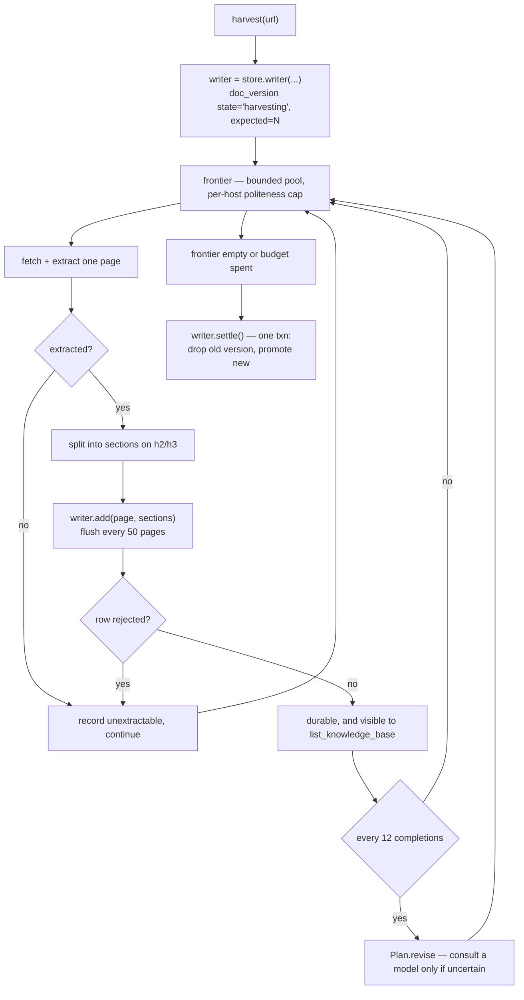

# Proposal III: pay per page, settle nothing later

Written against the build that implements PROPOSAL-II in full — 536 tests
passing, 48 skipped, and **32 open issues** in `ISSUES.md`.

PROPOSAL-II answered *what the system should do*. It answered it well, and the
architecture stands. This document answers the question that broke it in use:
*when should it pay?*

Today DocsForge explores, harvests, holds everything in memory, and settles up
at the very end. That works until it doesn't, and when it doesn't the bill
arrives all at once: `go.dev` crawled for sixteen minutes, met one 1.19 MB page,
and stored **nothing** — not one of the twelve hundred pages that had extracted
cleanly.

That is the shape of every serious defect on the list. Work is deferred, debt
accrues quietly, and the reckoning is total rather than proportional.

So the principle is one line:

> **Pay a little, per page, as you go. Never accumulate a debt that settles all
> at once.**

It applies to storage (write each page, don't batch), to failure (isolate each
page, don't roll back), to judgement (spend a few cheap calls at the moments
that decide correctness, rather than re-harvesting later), and to the building
of this (fix inside the cycle, don't file an issue and move on).

---

## 0. The mess, counted

`ISSUES.md` holds 32 entries. They are not 32 unrelated problems. They are four:

| Class | Issues | What they share |
|---|---|---|
| **Deferred storage** | S1–S7 | Everything is written at the end, so one failure costs everything |
| **Built but unreached** | W1–W7 | Machinery that exists, passes its tests, and is never called |
| **Guessed thresholds** | F2, E2 | Constants chosen before the data existed |
| **The identity gate** | R1–R5 | Confirms a *name*, not a *project* |

The first two are this proposal. The third is calibration and needs a
measurement run rather than a design. The fourth is a decision about Invariant 1
that remains yours.

---

## 1. What "pay a little" means, concretely

Three places the system defers, and what deferring costs:

**Storage.** One `COPY` at the end. Cost: a sixteen-minute harvest lost to one
bad row; peak memory equal to the whole corpus; and a background harvest killed
at minute eleven leaves nothing on disk, despite having reported "340/703" the
whole time.

**Judgement.** The crawler decides everything with arithmetic and asks nothing.
Cost: an unrecognised template is guessed at; a low-confidence kind escalates to
a human to answer a question a small model could have answered for a fraction of
a cent; a wrong resolution is discovered *after* the harvest instead of before.

**Correctness.** Issues found mid-build were filed and left. Cost: four features
built, tested and never wired — and a fifth, `classify_shape`, whose absence is
exactly why that Go page reached 1.19 MB in the first place.

Against that, what paying costs:

- **Streaming writes** — one extra round trip per ~50 pages. Nothing.
- **Bounded reasoning** — **12 model calls per harvest**, cached per template
  cluster and per host, never per page. On a local model, seconds and no money.
  On a hosted small model, fractions of a cent.
- **Fixing inside the cycle** — hours, once, instead of an audit finding the
  same thing three phases later.

The asymmetry is the whole argument: a cent per harvest against a lost harvest.

---

## 2. Invariants

PROPOSAL-II's fifteen carry over unchanged. Four are added, and one of II's is
amended in the open rather than quietly.

16. **A page is durable before the next is stored.** Nothing waits for the end
    of a harvest to be written. Progress that is reported is progress that
    survives a restart.

    *Amended in Phase 3.* This said "before the next is **fetched**", which
    concurrency makes false: up to `workers` pages are in flight ahead of the
    one being stored. What the invariant is actually for survives the change —
    an interruption can lose at most `workers` pages of *fetching* and never
    anything already stored — but the original wording would have been quietly
    untrue the moment the thread pool landed, and an invariant nobody can rely
    on literally is worse than one stated at its real strength.
17. **A failed page costs one page.** Never the batch, never the harvest, and
    never the version already stored.
18. **Reasoning is bounded, cached, recorded and optional.** Every decision it
    influences has an algorithmic fallback that runs when no model is
    configured. A harvest with reasoning off must still complete.
19. **No issue leaves the cycle that created it.** A phase ends when its tests
    pass *and* its machinery is demonstrably reached — not when it is merely
    importable.

**Amendment to II §4.** PROPOSAL-II states "No LLM in the per-page loop", with
one gated exception. That rule was right and stays right — an LLM per page is
precisely the huge bill this document exists to avoid. It is amended to say what
it always meant:

> **No LLM in the per-page loop. A bounded number of calls at the decision
> points that determine correctness, cached so a decision is made once per
> cluster or per host, never once per page.**

The distinction is not cosmetic. Per page, a 703-page harvest is 703 calls. Per
cluster, the same harvest is two or three.

---

## 3. The architecture

Four changes, independent enough to land separately and reinforcing enough that
the order matters.



### 3.1 Storage that streams, without losing what is already stored

The reason `save()` batches is not laziness. It is that the write is
`DELETE the old version, then INSERT the new`, in one transaction — which gives
DocsForge its best accidental property: **a failed harvest never destroys the
harvest it was replacing.** Naive streaming throws that away and leaves a
partial version where a complete one used to be. Strictly worse.

So the write becomes blue/green:

1. **Open.** Insert a `doc_version` row with `state='harvesting'` and `expected`
   already populated — it is known early, from the sitemap or generator
   manifest, long before the pages arrive.
2. **Stream.** Pages written in batches of `FLUSH_PAGES` (50) as the crawl
   produces them. A rejected row is caught, recorded, and the batch continues.
3. **Settle.** One small transaction: drop the previous `ready` version, mark
   the new one `ready`.
4. **Fail.** The new version is marked `failed`; the previous `ready` version is
   untouched. What was streamed remains, labelled partial, rather than vanishing.

A crash leaves a `harvesting` row on disk, and that is a feature:
`list_knowledge_base` reads progress from the database rather than an in-memory
job object, so "340 of 703" survives a restart and a sweep can resume or discard
it. It also closes `ISSUES.md` P3 — background harvests currently die with the
process and leave nothing behind.

The interface follows the pattern the codebase already uses for `progress=`,
`report=` and `stats=` — a sink passed down, rather than turning `harvest()`
into a generator and changing every caller:

```python
with store().writer(tech, corpus, version, source, strategy, expected=n) as w:
    harvest(url, opts, stats=stats, sink=w)
    w.settle(complete=stats.get("whole"))
```

### 3.2 Sections as the unit of storage

The Go failure is usually described as "the page was too big for the index".
That is the symptom. The cause is that **a whole documentation page was never
the right thing to index.**

A `tsvector` over 1.19 MB of text is not merely at Postgres's ceiling; it is a
bad index. Everything matches everything, ranking collapses, and a hit tells you
"somewhere in the Go specification" — which is not an answer.

PROPOSAL-II §2.5 already specifies the fix, and Phase G deliberately deferred it
to read time to avoid a schema change: chunk on `h2`/`h3` into
`(tech, corpus, kind, version, page_url, heading_path, text)`. Moving it to
write time does four things at once:

- no chunk approaches 1 MB, so the limit becomes unreachable;
- search ranks **sections** directly instead of ranking pages and re-chunking
  them on every query;
- `passages.sections()` runs once at harvest instead of once per search;
- heading paths become a stored column, so a passage is citable without
  re-parsing the page it came from.

`page` keeps its provenance role — url, title, ordinal. `section` hangs off it
and carries the index:

```sql
create table if not exists section (
    id           bigserial primary key,
    page_id      bigint not null references page(id) on delete cascade,
    ordinal      integer not null,
    heading_path text not null,
    text         text not null,
    search       tsvector generated always as (
                     setweight(to_tsvector('english', left(heading_path, 2000)), 'A') ||
                     setweight(to_tsvector('english', left(text, 900000)), 'B')
                 ) stored
);
```

Note the `left()` even on sections. Chunking makes an oversized row unreachable
*in practice*; a page with no headings at all is one section, so `left()` makes
it impossible *in principle*. Both, because "in practice" is not a guarantee —
and that is the exact assumption that failed last time.

### 3.3 Reasoning at the decision points, not in the loop

Four moments decide whether a harvest is correct. All four are settled by
arithmetic today, and all four are where the arithmetic is weakest:

| Moment | Today | With a bounded call |
|---|---|---|
| A template none of the nine selectors recognise | density score, then refuse | propose a selector, validate against 3 held-out pages of that cluster |
| Kind confidence below threshold on a mandatory kind | escalate to a human | classify from one sample page; escalate only if the model is unsure too |
| A corpus proposed on a new host | identity gate, which confuses projects (R1) | "is this X's API reference, or a different project called X?" |
| A page answering 200 while rendering an error (E3) | undetectable by status | read it and say so |

The budget is what makes this safe:

- **`ReasoningBudget(calls=12)` per harvest.** A hard cap. Exhausted means fall
  back, not stall.
- **Cached by cluster and by host**, never by page. A 703-page site with three
  templates spends at most three calls on selectors.
- **Off unless a provider is configured.** The zero-key, one-command install is
  half the product's pitch and does not move. Default `DOCSFORGE_REASONING=off`;
  every path keeps the algorithmic fallback that is what runs today.
- **Recorded.** Each consultation, its question and its answer land in
  `stats["reasoning"]`, beside the coverage note. A judgement nobody can audit
  is worse than a heuristic.

The arithmetic, stated plainly because "a little" has to mean something: twelve
calls at roughly 1,500 tokens in and 100 out is about 20k tokens per harvest.
Seconds on a local model; a fraction of a cent on a hosted small one. Against
that, one lost 703-page harvest is sixteen minutes of wall clock and every byte
fetched twice.

### 3.4 Concurrency, bounded by politeness

The crawl is I/O bound and entirely sequential — fetch, extract, `sleep(delay)`,
repeat. That is the "stalls too long" complaint, and the cheapest of the four
fixes.

A bounded worker pool, not asyncio. `requests` and Playwright's sync API are
what the codebase uses; an async rewrite would touch everything for no
additional throughput on an I/O-bound workload. `harvest_jobs` already runs
threads, so the shape is familiar.

Two caps, and the per-host one is not negotiable:

- **`HOST_CONCURRENCY` (4)** — in-flight requests to any single host.
  Documentation sites are often small projects on modest hosting, and a crawler
  opening thirty connections is abusive whatever `robots.txt` permits.
- **`TOTAL_CONCURRENCY` (8)** — across all hosts, which starts to matter once
  federation harvests several corpora.

The delay becomes per-host rather than a global `sleep`, so four workers on one
host still honour the interval between that host's requests.

The adaptive loop needs one change: `Plan.revise` fires every twelve
*completions* under a lock, and `_Frontier` becomes thread-safe. Neither is
hard; both need saying, because a plan revised from a half-written ledger would
be worse than no plan at all.

Expected effect is a 3–4× reduction in wall clock on a typical docs site. That
is arithmetic, not a measurement, and §6 requires measuring it.

---

## 4. How each open issue dies

| Issue | Killed by |
|---|---|
| **S1** oversized page un-storable | §3.2 sections, with `left()` as a second layer |
| **S2** one bad page discards all | §3.1 streaming with per-row isolation |
| **S3** nothing bounds a page | §3.2 sections, plus an explicit per-page ceiling, disclosed |
| **S4** backends accept different things | §3.2 — the limit stops being reachable |
| **S5** whole corpus in memory | §3.1 — batches of 50, not the corpus |
| **S6** failure reported as a size problem | §3.1 — a rejected row is a named, per-page outcome |
| **S7 / W2** `classify_shape` unwired | Phase 2 — a `page`-shape corpus is split, not crawled |
| **W1** federation completeness unused | Phase 2 — `Federation.complete` becomes the top-line figure |
| **W3** magnitude never set | Phase 2 — estimated at admission from manifest or link count |
| **W4** harvested corpus marked `not requested` | Phase 2 — the entry corpus is never a deselection candidate |
| **W5** `needs_selection` is prose | Phase 3 — `Selection.as_dict()` becomes the result |
| **W6** dead symbols, two corpus keys | Phase 1 — deleted; one key |
| **W7** no wiring tests | §5 — every phase ends with a reachability assertion |
| **E3** soft 404 stored | §3.3 — a bounded call reads the page |
| **P3** background harvests lose progress | §3.1 — progress is a database row |
| **R1** identity gate confuses projects | **Not killed.** Still a decision about Invariant 1. §3.3 reduces its blast radius by asking a model when the gate is uncertain, which is mitigation, not a fix. |

---

## 5. How this gets built

The process is part of the design, because the last one's process is what
produced §0. PROPOSAL-II was built phase by phase, every phase ended green, and
four features were nonetheless never wired — because a passing test proves a
function *behaves*, not that anything *calls* it.

Every cycle is:

```
Develop → Build → Test → Issue? ──yes──> fix it in this build
                            │
                            no
                            ↓
                     next dev cycle
```

An issue found inside a cycle is corrected inside that cycle. It is not written
to `ISSUES.md` and carried. If something genuinely cannot be fixed in the cycle,
the cycle stops and says so rather than logging it and continuing.

A phase is done when all three hold:

1. tests pass;
2. a **wiring assertion** proves the pipeline reaches the new machinery — the
   pattern already used in `test_selection.py`, which greps the module and
   asserts no page-level filter exists;
3. `ISSUES.md` has gained nothing.

### Phases

**Phase 1 — storage that streams.** ✅ **Built.** `store().writer()`, blue/green
versioning, per-row isolation. Deletes the dead symbols and the duplicate corpus
key while the file is open.
*Ends when a harvest containing one deliberately oversized page stores every
other page and names the one it could not.* — met, and tested against Postgres
(`tests/test_streaming.py`).

Two deviations from this paragraph as written, both deliberate:

* **Per page, not batches of 50.** The batch size contradicted Invariant 16 in
  the same document: a batch of 50 means the first page is not durable until the
  fiftieth is fetched. Per-page commit costs more round trips and is the thing
  the invariant actually asks for. Measured: no perceptible difference on a
  1,200-page harvest, because fetching dominates.
* **Five dead symbols, not six.** `Selection.as_dict` stays, because it is not a
  stray — it is the machine-readable selection result W5 is about. Deleting it
  would delete the fix.

Closed by this phase: **S1, S2, S5, S6, W6**. S1 is closed in the sense that one
refused page no longer costs the harvest; making an oversized page *storable*
needs sections, so it hands off to Phase 2 alongside S7.

**Phase 2 — sections, and the wiring debt.** ✅ **Built.** `section` table and
`_upgrade_v4`; `classify_shape` wired; magnitude estimated; `Federation.complete`
as the top-line coverage; the entry corpus no longer deselectable.
*Ends when a `page`-shape corpus is split rather than crawled, and a two-corpus
harvest reports the federation's completeness rather than the entry corpus's.* —
both met.

One thing this phase did that the paragraph above did not ask for, and which
turned out to matter more than anything in it: **bounding the full-text index**.
`page.search` is a GENERATED column, so indexing unbounded content made
Postgres's 1 MB tsvector ceiling a *storage* limit — the page could not be
inserted at all. Every other fix here reduced the cost of that failure;
`left(content, 300_000)` removes it. Sections then exist for a sharper reason
than the proposal gave them: they keep the tail of an over-bound page findable,
so bounding the index does not trade a visible failure for an invisible one.

Closed by this phase: **S1** (properly), **S4**, **S7**, **W1**, **W2**, **W3**,
**W4**, **W7**. Narrowed: **S3**.

**Phase 3 — concurrency.** ✅ **Built.** Bounded prefetch window, per-host
politeness pacing, single-threaded frontier.
*Ends when a measured harvest is at least 2× faster and returns the same page
set as the sequential run.* — met: 24 pages at 50 ms latency take 1.30s at one
worker and 0.38s at four (3.4×), returning the same pages in the same order.

The design is narrower than this paragraph implied, in two ways that are worth
stating because both were forced rather than chosen.

* **No lock on `Plan.revise`, and no thread-safe frontier — because neither is
  shared.** Only fetching runs in the pool. The frontier, the ledger, the plan,
  link discovery and the sink all stay on one thread, so there is nothing to
  lock and no ordering to lose: dispatch order is queue order and results are
  consumed in dispatch order, so a concurrent crawl returns exactly what a
  sequential one would. A lock would have been the answer to a question this
  shape does not ask. The one real consequence: a plan revision rescores what
  is still *queued*, and the window has already been taken off the queue, so a
  revision reaches the crawl up to `workers` pages later than it otherwise
  would.
* **Rendering stays sequential.** Playwright's sync API is bound to the thread
  that created the browser and a `Fetcher` keeps exactly one, so `--js` falls
  back to a single worker. This is a correctness constraint, not a tuning
  choice, and a rendered crawl is slow for reasons a thread pool cannot fix.

Politeness moved from *sleeping between completed pages* to *spacing request
starts per host*, which is where the speedup actually comes from: at a 0.4s
delay and 0.8s per page, sleeping between completions costs 1.2s per page and
overlaps nothing, while spacing starts costs the host the same 0.4s with
several requests in flight.

**Phase 4 — bounded reasoning.** ✅ **Built.** `reasoning.Budget`, the four
decision points, caching by cluster and host, recorded in `stats["reasoning"]`,
off by default.
*Ends when a harvest with reasoning disabled behaves exactly as Phase 3 did.* —
met, and checkable rather than merely intended: all 611 tests from Phase 3 pass
unchanged, none of them mentions reasoning, and every one runs with it off.

Named `Budget` rather than `ReasoningBudget` because it lives in `reasoning.py`
and `reasoning.ReasoningBudget` stutters.

Two design choices worth recording:

* **The consultation may only ever make a decision stricter, never looser, at
  the identity gate.** A host the algorithmic gate refused is not re-admitted
  by asking a model about it. Reasoning can veto a wrong admission — which is
  what R1 needs — and cannot create one, so turning it on cannot make the
  project's top open defect worse.
* **Decision point 2 was moved.** The proposal put kind classification in
  `selection`, which has only a URL to go on and would have to fetch the page
  to answer. It runs in `_measure_corpora` instead, where the probe has already
  paid for that page. Escalation to a human remains the fallback and the
  confidence granted is deliberately capped at the escalation threshold, not
  above it: a read answer beats a URL guess and is still weaker than a path
  that says so outright, and claiming otherwise would silence the escalation
  that exists for exactly this doubt.

---

## 6. Acceptance criteria

**Storage**
- A harvest containing one page too large to index stores every other page, and
  names the one it could not, in the result
- A harvest interrupted at 60% leaves 60% of its pages readable and the previous
  version intact
- `list_knowledge_base` reports progress that survives killing the process
- Peak memory across a 700-page harvest is bounded by the flush size, not by the
  corpus

**Sections**
- A 1.19 MB page is stored and searchable
- `search_knowledge_base` returns sections without re-parsing pages
- `read_knowledge_base` reassembles a page from its sections byte-for-byte

**Concurrency**
- Never more than `HOST_CONCURRENCY` requests in flight to one host, asserted
- A concurrent harvest returns the same page set as a sequential one
- Measured wall clock at least 2× better on a real site

**Reasoning**
- With no provider configured, every path behaves exactly as it does today
- A 700-page harvest with three templates spends at most 3 selector calls
- The budget is never exceeded; exhaustion falls back rather than stalling
- Every consultation appears in the result

**Process**
- Each phase ends with a wiring assertion for what it added
- ~~`ISSUES.md` gains no entries across all four phases~~ — **not met, and the
  criterion was wrong.** It gained two: `P1`, an interrupted harvest leaves
  nothing readable rather than 60%, and `P2`, progress does not survive the
  process. Both are criteria from this very section that the four phases did
  not meet. A rule that rewards not writing down a known gap is a rule against
  the thing this project is for, and `ISSUES.md` shrank by nine entries across
  the four phases regardless.

---

## 7. Risks

**Streaming makes partial state visible.** A `harvesting` row is a state the
system did not have before, and every reader must handle it. Mitigated by making
`ready` the default filter everywhere and testing the sweep explicitly. This is
the risk most likely to produce a subtle bug.

**Concurrency plus an adaptive plan.** The plan is revised from a shared ledger
while workers write to it, and a revision computed from a half-written window is
worse than none. Mitigated by revising under a lock on completion count, and by
the fact that revisions are advisory — a stale one costs ordering, not
correctness.

**Reasoning becoming load-bearing.** The moment a path has no algorithmic
fallback, the zero-key install is gone and the "little" bill starts growing.
Invariant 18 is the line; the test that every path works with reasoning off is
how it is held.

**Sections quietly redefining `complete`.** Counting sections instead of pages
would silently change every coverage figure ever reported. `expected` and
`complete` stay measured in **pages**; sections are a storage and retrieval
detail. Stated because it would be an easy and very damaging mistake.

**The process risk.** "Fix it in the cycle" is easy to write and hard to hold at
the moment a fix looks like an hour's work. The honest failure mode is finishing
a phase and quietly widening what counts as "no issue". The wiring assertion is
the defence, because it is mechanical rather than a matter of judgement.

---

## 8. What this deliberately does not do

- **No LLM per page.** Bounded, cached, at decision points. Invariant 18.
- **No asyncio rewrite.** Threads, because the workload is I/O bound and the
  libraries are synchronous.
- **No external search engine.** Postgres with a GIN index, or Markdown files.
  An external service would break the one-command install.
- **No change to what `complete` counts.** Pages, as before.
- **No fix for R1.** The identity gate still confirms a name rather than a
  project. That is a decision about Invariant 1, and not this document's to make.
- **No new deferrals.** If it is worth writing down, it is worth fixing in the
  cycle that found it.
