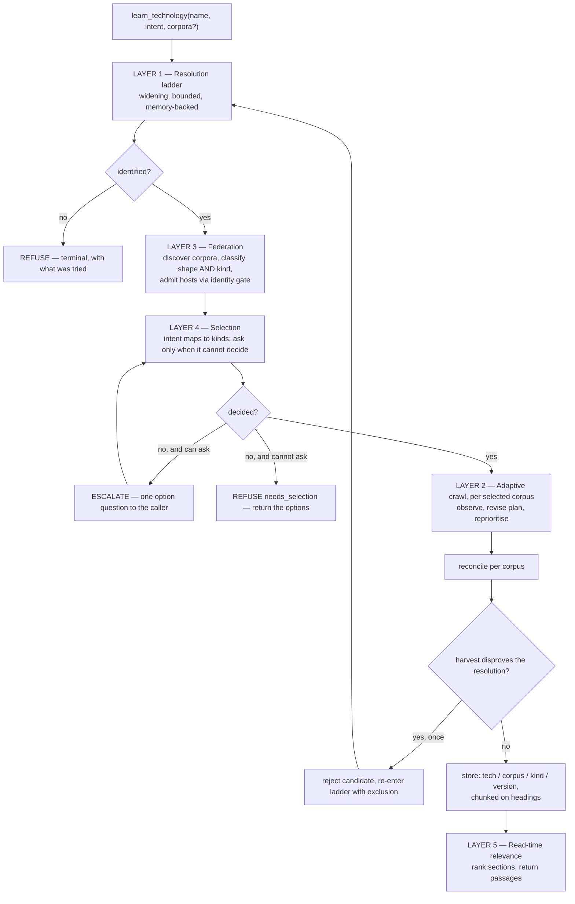
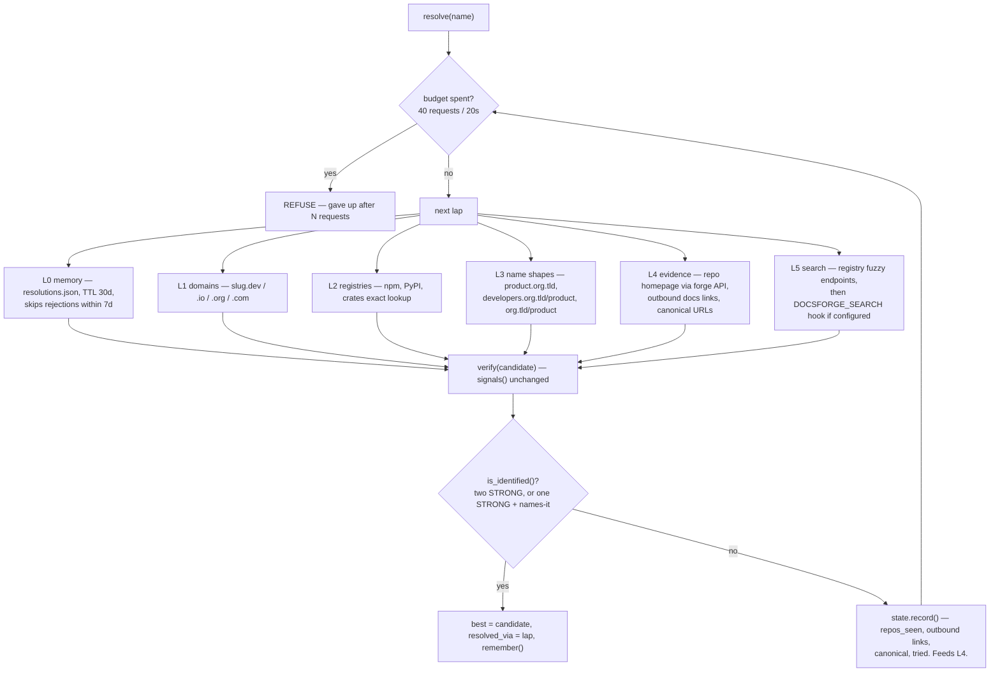
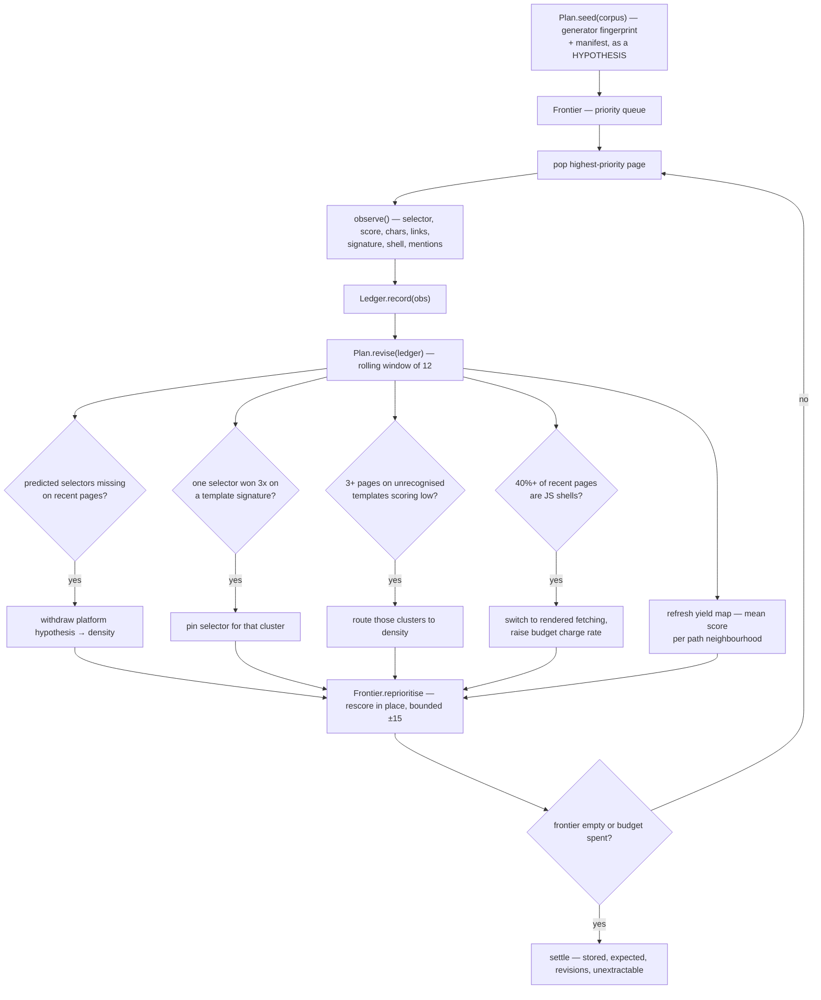
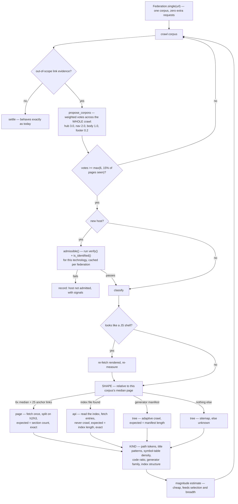
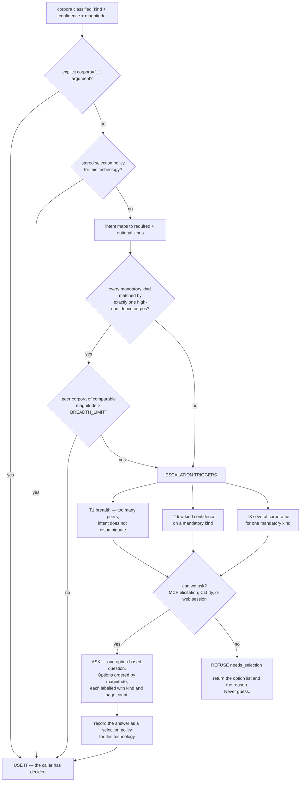

# Proposal II: reach the tail, harvest what is needed, spend nothing on the guarantee

Written against `de154ae` (61 commits, 58 files, 13,614 lines, 348 of 349 tests
passing). Supersedes RESOLVER-LOOP, ADAPTIVE-CRAWLER, CLOSED-LOOP-CRAWLER and
FEDERATED-HARVEST. Two rules in those documents were corrected by later work and
are withdrawn here: the **global scope-revision rule** and **`_related_hosts`
sibling matching**. Do not implement them as originally written.

The first proposal answered *how do we stop reporting unearned confidence*. It
succeeded. This one answers the two questions that came after:

- **How do we reach the technologies we currently cannot** — the ones whose
  documentation is not one crawlable tree?
- **How do we harvest what a caller actually needs** — without turning a
  completeness guarantee into a curated subset nobody was told about?

The second question has a consumer. FlowIT calls DocsForge at import and
function-trigger time to make its generated plan map reliable. That is a
different need from a human reading a manual, and the design now says so.

---

## Status — 2026-08-24

All seven phases are implemented. The suite is **536 passing, 48 skipped**, from
349 when this document was written.

| Phase | State | Note |
|---|---|---|
| A unblock | **done** | packaging, pins, background harvests, PRODUCT.md |
| B instrumentation | **done** | `observation.py`, `instrument.py`, `measure.py` |
| C resolution ladder | **done** | L0/L3/L4/L5; F6 1/20 -> 8/20 correct |
| D adaptive extraction | **done** | `Plan.revise` on a rolling window, `Frontier.reprioritise` |
| E federation | **built, partly unwired** | discovers, admits and harvests; shape classification and magnitude are never called (`ISSUES.md` W2, W3) |
| F selection | **built, one wiring bug** | intent, triggers, policy, `strict`, asks before refusing; an unclassified entry corpus is wrongly deselected (W4) |
| G retrieval | **done** | h2/h3 passages, heading paths, `kind` filter |

An audit on 2026-08-24 (`AUDIT.md` §10) found four things that are built,
tested and never called — including `Federation.complete`, which means the
headline coverage of a federated harvest is still the entry corpus's alone.
They are W1-W7 in `ISSUES.md`. Every one of them has passing tests, which is
the point: a unit test proves a function behaves, not that anything invokes it.

Four things were finished after the first pass, and they were the four that
mattered:

- **The crawl now revises its own plan.** `Ledger` accumulates an `Observation`
  per page — reported from the parse extraction already did, not a second one —
  and every twelfth page `Plan.revise` re-derives from the last twelve, emitting
  the five rules of §2.2. `Frontier.reprioritise` rescores what is queued.
  Pinned selectors and density routing re-extract pages the CONTENT order got
  wrong. Every revision lands in `stats["revisions"]`.
- **L4 exists.** `ResolveState` was recording repository backlinks, outbound
  documentation links and canonical URLs from every candidate, and nothing read
  them back. `from_evidence` does, and `verify()` now records the page of a
  candidate it is about to fail — which is the one most likely to say where to
  look next.
- **Federation harvests.** Selected corpora are fetched per shape and filed
  separately, each settling its own count.
- **Selection asks.** A channel can be installed (`selection.set_asker`); the
  CLI uses the terminal; over MCP the model relays the question and answers
  with `corpora=`. Refusing is the fallback, not the policy.

Measured along the way, and both correct this document:

- **The template signature must not include content shape.** §2.2 specifies
  "three-level ancestry plus a coarse shape". Measured, that gave 0.46 distinct
  templates per page — 22 signatures across 40 Terraform pages that shared one
  identical ancestry — because heading and code counts describe what a page
  says, not how it is built. Ancestry alone gives 0.08. Corrected in code.
- **Extraction was never the emergency.** §1.2 reads as though unrecognised
  templates are widespread. Measured across 452 pages: 2.8% fall-through on
  correctly-resolved sites, 61% on wrongly-resolved ones. The fall-through rate
  was largely a *proxy for bad resolution*. Precision, not extraction, was the
  bottleneck — which inverts the D-before-E ordering argued in "Why this order".

§9 records what remains, which is now a short list of judgement calls rather
than unbuilt machinery.

---

## 0. The invariants

Everything below is subordinate to these. A change that improves coverage or
usefulness by violating one is not an improvement; it is a different, worse
product.

1. `is_identified()` is unchanged. Two STRONG signals, or one plus `names-it`.
   More candidates, more corpora, more laps — never a lower bar.
2. `names-it` stays out of STRONG. Mention count is corroboration, never proof.
3. The `install-mismatch` veto stands.
4. **Selecting corpora is scope. Dropping pages inside a corpus is filtering.**
   Scope is declared, recorded and reported. Filtering is forbidden. A selected
   corpus is harvested whole or reported partial — never trimmed to taste.
5. An unselected corpus is recorded as `not requested`, with its magnitude, and
   is never silently absent.
6. Relevance *within* stored documentation is applied at read time, never at
   harvest time.
7. Adaptation reorders and re-extracts. It never filters. An exhaustive crawl
   returns the same page set as today's.
8. Admitting a corpus never changes another corpus's `complete`.
9. Top-level `complete` is `None` unless every **selected** corpus is `True`.
10. **When the system cannot determine what is needed, it asks. It never
    guesses.** If it cannot ask, it refuses and returns the options.
11. Every revision, exclusion, refused host, skipped corpus, escalation and
    selection decision is recorded and surfaced next to the coverage note.
12. Both resolution refusals stay terminal. The outer loop is bounded to one
    retry.
13. The zero-key, one-command install stays the default path. Model assistance
    is opt-in, gated, validated against held-out pages, and off.
14. Federation is not permission to roam. A host enters only through the
    identity gate.
15. `unknown` remains distinct from `complete` and `incomplete`. Unearned
    confidence stays inexpressible.

---

## 1. What is blocking us

### 1.1 Resolution is a straight line with three exits

`from_domains()` guesses `{slug}.{dev,io,org,com}`; `from_registries()` does
exact-name lookup in npm, PyPI and crates. Miss both and `resolve()` has nothing
left — that is F6, and it makes every multi-word technology unreachable. Worse,
`verify()` fetches each candidate, extracts a `repo-backlink`, fails, and
**discards the evidence** — a repository URL whose `homepage` field is the code
owner declaring where the docs live.

### 1.2 The crawl is open-loop

The strategy is fixed from the entry page, which is the least representative
page on any documentation site. `CONTENT` is nine selectors with a silent
fall-through to `soup.body`, so an unrecognised template stores navigation as
documentation and says nothing. `_crawl_html` is a `deque`, so truncation keeps
whatever the nav listed first.

### 1.3 One technology is assumed to be one crawlable tree

`docs_scope()` returns one prefix; `_crawlable()` requires `hostname == host`.
For any technology of size that is false — a manual, a specification, a
generated API reference frequently on a second domain, a package registry. The
pipeline harvests one, agrees with the sitemap, and records `complete=True`.

**This is the most serious defect in the project.** Whole corpora missing, total
coverage reported. It is the failure `_coverage_note()` exists to prevent,
occurring one level above where that function can see.

### 1.4 There is no notion of *what the caller needs*

`harvest(url)` takes a URL and grabs everything under a prefix. It has no
concept of purpose, and no concept of what kind of documentation a corpus is. So
it cannot distinguish "the caller needs the symbol reference to resolve an
import" from "the caller is reading the tutorial", and it treats a changelog as
equal in value to an API reference.

For a platform spanning dozens of independent service manuals, this makes the
request ill-formed: harvesting everything is enormous and mostly irrelevant,
harvesting some and reporting a number is misleading, and there is no mechanism
to find out which part was meant.

### 1.5 There is no way to ask

When the system genuinely cannot determine what is needed, it has two behaviours
available: guess, or refuse. It should have a third.

### 1.6 `learn_technology` blocks past client timeouts

F7. A 703-page harvest blocks ~12 minutes; MCP clients time out. The headline
tool reads as broken.

### 1.7 Retrieval returns documents where passages would do

One page of a generated API reference can be 20k tokens to answer a one-line
question. A documentation tool costing more context than it saves has inverted
its purpose.

### 1.8 Three defects outside the architecture

- **No packaging.** No `pyproject.toml`, `setup.py` or `Dockerfile`.
  `pip install docsforge` is impossible, not merely unimplemented.
- **Zero dependency pins.** `grep -c '==' requirements.txt` returns 0. This is
  why `test_html_title_is_literal_text` fails — `beautifulsoup4` floated.
  `mcp>=2.0` is the same risk aimed at the whole tool surface.
- **PRODUCT.md contradicts the build**, under an *"Evidence on Hand — do not
  fabricate beyond it"* heading. A project whose pitch is calibrated confidence
  cannot ship that file.

---

## 2. The architecture

Five layers.



---

### 2.1 Layer 1 — a resolution ladder

Six generators in order, each cheap, all subordinate to the same unchanged
verification gate.



**L3 closes F6.** A multi-word name carries structure — the first token is
usually the vendor, the rest the product — and vendors publish on a small set of
predictable shapes. Reuses `_looks_like_software()` and `probe_docs_root()`
unchanged, so a shape hit meets exactly the standard a domain hit meets.

**L4 is the loop-back.** `ResolveState.record()` is the hinge: every candidate,
passed or failed, deposits what its fetch revealed where the next lap can use
it.

**L5 stays keyless by default** — npm and crates.io fuzzy search endpoints we do
not currently use, then an optional `DOCSFORGE_SEARCH` hook. **Never scrape a
search engine's HTML endpoint**: brittle, against terms, and unbecoming of a
resolver whose pitch is trustworthiness.

**Memory needs an exit.** `forget_resolution(name)` ships with the cache. A
cache the user cannot clear is a trap.

---

### 2.2 Layer 2 — a crawl that revises its own plan

The plan is a hypothesis. Every page reports measurements; every twelve pages
the plan is re-derived from them.



**Read the site's own index first.** Most documentation is emitted by about ten
generators, each identifiable from `<meta name="generator">` or a two-marker
class fingerprint, and several publish a machine-readable manifest: MkDocs
Material's search index, Sphinx's `objects.inv` (every documented symbol and its
page), Nextra and Mintlify page maps. Where one exists, `expected` becomes **the
site's own count** rather than a sitemap estimate. That is the strongest form
our completeness claim can take, and it costs one request.

**Template clustering makes adaptation structural.** A signature is the winning
container's three-level ancestry plus a coarse shape. Sites have a handful of
layouts, so a rule is learned per layout — finer than per-site, cheaper than
per-page, and it does not forget.

**No silent fallback.** Density scoring (text length, link density, code blocks,
headings, boilerplate penalty) replaces the fall-through to `soup.body`. A page
that still cannot be extracted raises. An empty container beside a script bundle
is diagnosed as a JS shell and retried rendered once, which makes `--js`
automatic. Pages reached but unreadable land in `stats["unextractable"]` and are
disclosed.

**Ordering is not filtering.** The frontier demotes changelog-shaped
neighbourhoods and low-yield directories; it drops nothing.

---

### 2.3 Layer 3 — federation: shape *and* kind

A technology of any size is a set of documentation bodies. Each needs two
classifications, and conflating them is why the current design cannot serve
FlowIT:

- **Shape** — *how to acquire it*: `tree`, `page`, `api`, `dump`, `index`
- **Kind** — *what it is for*: `spec`, `language`, `api`, `sdk`, `adk`,
  `guide`, `cookbook`, `operations`, `changelog`, `meta`



**Corpora emerge from aggregate evidence, not from a hub page.** Some projects
publish a prose page enumerating their parts; many express the same thing as a
sidebar, a grid, or not at all. Weighting links by position — a sidebar entry is
information architecture, a footer link is boilerplate on every page — and
summing across the whole crawl works in all three cases. Hub detection survives
as an accelerator that triples one page's weights, not as a prerequisite.

**Hosts are admitted by the identity gate.** Sibling-subdomain matching is
wrong: it admits a project's own package host and rejects every documentation
SaaS and every separate-domain API reference, which between them cover a large
share of major ecosystems. Run `verify()` + `is_identified()` against the
candidate host for the same technology — one fetch, cached per federation. It is
already written, already tested, already trusted, and it generalises to hosts
nobody anticipated.

**Thresholds are relative.** An absolute byte threshold is meaningless across
corpora, so `page` is *six times this corpus's median page with a
self-referential table of contents*. Classification runs **after** the render
decision, or a JS-driven API reference measures as 2 KB and classifies as a
tree.

**Kind detection signals**, in rough order of reliability: the generator family
(godoc, javadoc, docs.rs, hexdocs, Doxygen, Sphinx autodoc → `api`); symbol-table
density and repeated signature markup → `api`; path tokens (`/reference/`,
`/api/`, `/sdk/`, `/spec/`, `/guide/`, `/tutorial/`, `/examples/`, `/blog/`);
title patterns; code-to-prose ratio; whether pages are named after identifiers
rather than tasks. Kind carries a confidence, and low confidence on a *mandatory*
kind is one of the three escalation triggers in Layer 4.

**Per-corpus accounting makes mid-run growth safe.** A corpus finishing at 47 of
47 stays complete forever; a newly admitted corpus starts its own count from
zero. This is why the global scope-revision rule is withdrawn — it invalidated
`expected` for work already correctly done.

**Versions live on the corpus.** A specification is per-release while a package
registry is per-module; a tutorial and a library reference may share a version
while a set of enhancement proposals has none. One label across a federation
files a versionless corpus under a version it does not have. Store key becomes
`tech/corpus/version`; unversioned corpora file under `undated`.

---

### 2.4 Layer 4 — selection: harvest what is needed, ask when unsure

This is the layer the FlowIT requirement demands, and the one that makes
platform-scale technologies tractable without spending the guarantee.

**The distinction that makes it safe:** choosing *which corpora* enter scope is
a declaration, recorded in the result. Dropping pages *inside* a selected corpus
is filtering, and is forbidden. A selected corpus is harvested whole or reported
partial. An unselected corpus is listed with its magnitude and marked
`not requested` — never silently absent.



**Intent is a first-class parameter.** `learn_technology(name, intent=...)`,
defaulting to `reference`.

| Intent | Mandatory kinds | Optional | Excluded |
|---|---|---|---|
| `resolve-import` (FlowIT) | `api`, `sdk` | `spec`, `language` | `guide`, `cookbook`, `changelog`, `meta`, `operations` |
| `implement` | `api` | `guide`, `cookbook`, `sdk` | `changelog`, `meta` |
| `learn` | `guide` | `language`, `spec`, `cookbook` | `changelog`, `meta` |
| `operate` | `operations` | `guide`, `api` | `meta` |
| `reference` (default) | — | everything | `meta` |

**Escalation is rare by construction.** Three triggers only. A single-corpus
site never escalates. A technology with a manual, a specification and one API
reference never escalates under any intent, because each mandatory kind is
matched unambiguously. Escalation happens where it should: platform-scale names,
genuinely ambiguous classification, and ties.

**When it asks, it asks once**, with options ordered by magnitude and each
labelled with kind and estimated page count. The answer is stored as a selection
policy for that technology so the question is never asked twice — clearable with
`forget_selection(name)` alongside `forget_resolution(name)`.

**When it cannot ask, it refuses and returns the options.** Never guesses.
Automated callers (FlowIT, CI, batch jobs) get a machine-readable
`needs_selection` result they can act on or surface, which is strictly better
than a silently truncated harvest that looks successful.

#### The FlowIT contract

FlowIT calls at import and function-trigger time and needs the generated plan
map to be reliable. That maps onto an explicit, checkable contract:

```
learn_technology(name, intent="resolve-import", strict=True)
```

- Mandatory kinds are `api` and `sdk`. `guide`, `cookbook`, `changelog` and
  `meta` are excluded from scope — declared, listed, `not requested`.
- Under `strict=True`, if any **mandatory** corpus settles `INCOMPLETE` or
  `unknown`, the result carries `usable_for_planning: false` with the reason.
- FlowIT gates on that flag. A plan map is generated from complete symbol
  coverage, or it is not generated.

This is the honesty contract doing real work rather than decorating a response:
a downstream system can *refuse to act* on the basis of a coverage value. It is
also the strongest argument for the whole design — no competitor returns a
figure a caller can safely gate on, because no competitor knows what its own
coverage is.

---

### 2.5 Layer 5 — relevance at read time

Selection decides which corpora are stored. Within what is stored, relevance is
applied on retrieval, never on ingestion — otherwise every completeness claim
becomes a claim about an undisclosed subset.

Chunk on `h2`/`h3` at save time into `(tech, corpus, kind, version, page_url,
heading_path, text)`. Rank **sections** rather than pages with the existing
Postgres GIN index. `search_docs` returns passages with heading paths and a
context window, and can filter by `kind` — so FlowIT queries only the `api`
corpus and never has a tutorial paragraph compete with a function signature.

Embeddings stay optional. A required vector store would break the one-command
self-hosted install that is half the pitch.

---

## 3. How each finding dies

| Finding | Killed by |
|---|---|
| **F6** multi-word names unresolvable | L3 name shapes; L5 fuzzy registry search as backstop |
| **F7** `learn_technology` blocks past timeouts | Phase A: harvest ID returned immediately, background execution, progress via `list_knowledge_base` |
| Whole corpora missed, `complete=True` | Layer 3 federation + per-corpus accounting |
| Platform-scale names ill-formed | Layer 4 breadth trigger → ask, or refuse with options |
| No way to serve a specific need | Layer 4 intent → kind mapping |
| Navigation stored as documentation | Density scoring, no silent `soup.body` fallback |
| Truncation keeps arbitrary pages | Frontier ordering by manifest position, depth, yield |
| JS sites silently empty | Shell detection → automatic single rendered retry |
| `expected` estimated where it could be counted | Generator manifests; `page` and `api` shapes give exact counts |
| Context bloat on retrieval | Section chunking, passage ranking, `kind` filter |
| Wrong resolution never detected | Outer loop: per-corpus mention rate retracts and re-enters the ladder once |
| Downstream cannot trust coverage | `strict=True` + `usable_for_planning` |
| Cannot install in one line | `pyproject.toml` with extras |
| Tests break without a code change | Pin `beautifulsoup4`, `mcp`, `markdownify`, `nh3` |
| Docs contradict the build | Regenerate or delete PRODUCT.md |

---

## 4. What this deliberately does not do

- **No filtering inside a corpus.** Ever. Invariant 4.
- **No guessing on ambiguity.** Ask, or refuse with options. Invariant 10.
- **No vector store by default.** Optional, never required.
- **No LLM in the per-page loop.** One gated exception: proposing a selector for
  an unrecognised template, once per *cluster*, validated against three held-out
  pages, recorded, off by default.
- **No search-engine HTML scraping.**
- **No curated submission registry.** That is a competitor's moat and the
  opposite of ours: we work on anything immediately, including private and
  internal documentation, with no approval queue.
- **No unbounded federation.** Identity-gated hosts, declared exclusions,
  `MAX_CORPORA`, per-corpus budgets, breadth escalation.

---

## 5. Acceptance criteria

**Layer 1**
- A multi-word vendor-product name resolves, `resolved_via` naming the lap
- A name in no registry, whose homepage is declared only in repository metadata,
  resolves via L4
- A candidate failing `is_identified()` still refuses, from **every** lap — one
  test per lap
- A cached resolution returns with zero HTTP requests; `forget_resolution()`
  clears it
- A pathological name refuses within its stated budget

**Layer 2**
- A site whose entry page misleads the fingerprint recovers, and the withdrawal
  is recorded
- An unknown template extracts via density scoring, not `soup.body`
- A JS-rendered site harvests without `--js`
- An exhaustive crawl produces byte-identical output to `de154ae`
- Pages reached but unextractable appear in the result

**Layer 3**
- A single-corpus site issues no additional requests versus `de154ae`
- A technology with a specification, a manual and a separate-host API reference
  yields three corpora with independent counts and correct kinds
- A host failing `is_identified()` is refused and the refusal is recorded
- Admitting a corpus does not change an already-complete corpus's `complete`
- Corpora with differing versions are recorded separately, never unified

**Layer 4**
- `intent="resolve-import"` on a multi-kind technology selects `api` and `sdk`,
  and lists the rest as `not requested` **with magnitudes**
- A single-corpus site never escalates
- A three-corpus technology with unambiguous kinds never escalates
- A platform-scale name escalates, and in a non-interactive session refuses with
  `needs_selection` and the option list — never a partial harvest reported as
  successful
- An answered escalation is stored and not asked again; `forget_selection()`
  clears it
- Under `strict=True`, a mandatory corpus settling `INCOMPLETE` yields
  `usable_for_planning: false` with a reason
- Top-level `complete` is `None` while any **selected** corpus is partial

**Layer 5**
- `search_docs` returns sections with heading paths, not whole pages
- `kind` filtering works, so an `api` query never returns tutorial prose
- Mean returned tokens fall materially against the current `read_docs`
- The coverage note is present on every result

**Outside the architecture**
- `pipx install docsforge` and `uvx docsforge-mcp` work from a clean machine
- CI green on a fresh environment with no unpinned resolution
- No tracked document contradicts the build

---

## 6. Plan

### Phase A — unblock · **first, alone**
F7 background harvesting. `pyproject.toml` with extras. Pin the four
dependencies that matter. Regenerate or delete PRODUCT.md. Gitignore
`.impeccable/`.

*Nothing else ships until a stranger can install this in one command and the
marquee tool does not time out.*

### Phase B — instrumentation
`Observation`, `Ledger`, `ResolveState`, `Budget`. Changes no behaviour. Run
against twenty real technologies and read the numbers before writing a single
revision rule or threshold.

### Phase C — resolution ladder
L3, then L4, then L0 with `forget_resolution()`, then L5. One test per lap
asserting the bar held.

### Phase D — adaptive extraction
Generator fingerprinting, manifest ingestion (MkDocs and Sphinx first), density
scoring, shell detection, frontier ordering.

### Phase E — federation
Data model, `page` shape, per-corpus accounting, weighted corpus proposal,
identity-gated host admission, `api` shape, kind classification.

### Phase F — selection and the FlowIT contract
Intent parameter, kind mapping, the three escalation triggers, elicitation,
selection policy with `forget_selection()`, `strict` and `usable_for_planning`.

### Phase G — retrieval
Section chunking, `kind`-filtered passage ranking, token measurement.

### Why this order

Phase A is not architecture and comes first anyway: the best resolver in the
world is worth nothing behind a twelve-minute blocking call and a clone-only
install. Phase B before any adaptive rule or threshold, because rules written
without data are guesses — expect two of the five revision rules to prove
worthless and one unanticipated rule to prove essential, and prefer learning
that from measurements. Phase C before E because federation multiplies whatever
resolution produces, mistakes included. Phase D before E because classification
depends on fingerprinting. **Phase F after E because selection cannot choose
between corpora that do not exist yet** — this is the sequencing that matters
most, and the temptation will be to build intent handling early because it is
the visible feature. Phase G last: it changes no stored data and can land any
time after chunking exists.

---

## 7. Risks

**Selection becoming filtering by degrees.** The most dangerous risk in this
document. Once `intent` exists, every future request to "just skip the
irrelevant pages" will sound reasonable, and each concession will be small.
Invariant 4 is the line: corpus granularity, declared and reported. Enforce it
with a test asserting a selected corpus is harvested whole.

**Escalation fatigue.** A tool that asks often is a tool people stop using. The
three triggers are deliberately narrow and the policy cache makes each question
one-time. If Phase B data shows escalation firing on ordinary technologies,
tighten the triggers rather than widening the guesses.

**Adaptation drifting into dishonesty.** A crawler that changes its plan can
change what it was measuring. Mitigated by invariants 7, 8, 9 and 11, and by
recording revisions beside the coverage note rather than in a log nobody reads.

**Latency.** Six laps and multiple corpora each fan out. Mitigated by memory,
early short-circuiting, budgets at every level, and Phase A making long harvests
non-blocking.

**Complexity outrunning the tests.** 349 tests cover a straight-line pipeline. A
branching, self-revising, escalating one needs more. Every phase ships with the
test that would have caught its worst failure — and for this project that means
a test asserting *refusal*, not a test asserting success.

**Positioning outrunning the code.** F6 and F7 are open and PRODUCT.md is stale.
Keep known defects in the README, not only in AUDIT.md.

---

## 8. Open questions

- What is `BREADTH_LIMIT`? Eight is a guess; Phase B data on real platform names
  should set it.
- Should a corpus refused by the identity gate be retried on a later harvest, or
  remembered as refused? Leaning retried-with-backoff — a site can add the
  evidence later.
- Is a specification with 91 of 91 sections `complete`, or is `complete` only
  meaningful over pages? This affects the contract and should be decided
  deliberately, not discovered during implementation.
- Should `intent` be inferable from the calling context rather than passed? It
  would be convenient, and it is exactly the kind of convenience that becomes an
  unrecorded assumption. Current answer: explicit, defaulting to `reference`.
- When a selection policy is stored and the technology later grows a new corpus,
  does the policy silently exclude it? **It must not.** Proposed: a stored policy
  records the corpora that existed when it was made, and a newly appearing
  corpus of a mandatory kind re-triggers escalation.
- Does `adk` warrant a distinct kind from `sdk`, or is it a subtype? Deferred to
  Phase E, when real classification data exists.

---

## 9. What remains

Everything in §§1-8 is built. What is left is judgement calls and calibration,
not unbuilt machinery. `ISSUES.md` carries the working list; this is the part
that bears on the design.

### 9.1 The identity gate — **decision required**

The standing risk, unchanged since Phase B measured it. `is_identified()`
confirms a page is about something *with that name*, not that it is the right
project. Of 20 single-word names, 9 resolved to something that was not the
documentation; the `repo-identity` signal added in Phase C fixed three. The
survivors ride on the one path it cannot outrank:

> **own-domain** (the hostname contains the name) **+ names-it** (the page says
> the name three times) **= identified.**

`flask` reaches an unrelated to-do app at flask.io. `polars` reaches a
third-party site. `github actions` reaches a parked page at githubactions.com —
newly reachable *because* L3's concatenation shape works, which is the clearest
demonstration available that reaching further finds wrong answers as readily as
right ones.

Closing it means changing `is_identified()`, which **Invariant 1 declares
unchanged**. The invariant forbids a *lower* bar; raising it is not forbidden,
but it is a deliberate amendment to a stated invariant and should be made as
one. Three options, in increasing blast radius, are in `FINDINGS-C.md`:
strengthen `_looks_like_software` (a single footer forge link currently
satisfies it), rank verified candidates by signal strength instead of taking the
first, or raise the gate itself.

Federation admits hosts through this same gate, so the cost of leaving it open
rises with every corpus admitted.

### 9.2 Provisional numbers

`BREADTH_LIMIT` (8), `MIN_KIND_CONFIDENCE` (0.5) and the revision thresholds in
`Plan` (a window of 12, three wins to pin, 40% shells) are starting points, not
findings. `measure.py` collects what is needed to fit them; `measurements/`
holds 452 observations already.

**`DENSITY_FLOOR` no longer belongs on that list.** A constant assumes every
site's pages sit on one scale, and they do not — an API reference that is mostly
signatures and anchors scores low throughout, so a global floor refuses the
whole corpus, while a wordy tutorial site scores high throughout and the same
floor never catches its navigation. Rule R6 now fits the floor per template from
the site's own distribution, over the scores the `Ledger` already holds, at no
extra request.

The fit is `min(median - 1.5*MAD, median/2)`, clamped. The second term is not
decoration: `median - k*MAD` collapses onto the median whenever a template
scores consistently — the normal case — and a floor at the median refuses the
bottom half of a site's own documentation. Caught live on docs.astro.build,
where the first version fitted 0.60 against a median near 0.75.

**`BREADTH_LIMIT` should not be fitted the same way.** The count is the wrong
variable: what makes a platform hard is how evenly magnitude is spread, not how
many peers there are. A concentration measure removes the constant instead of
tuning it.

### 9.3 Elicitation over MCP is indirect

`selection.set_asker` accepts any channel and the CLI uses the terminal. Over
MCP the question is returned to the model, which relays it and answers with
`corpora=` — a complete round trip, and arguably the right one, since the model
is the thing with a user attached. The SDK's `elicit_with_validation` would ask
the client directly; it needs a live `ServerSession` reached from a sync tool in
a worker thread, and it is not wired.

### 9.4 The corpus is not yet a store column

`corpus_key()` files each corpus under `{tech}--{corpus}`, which is isomorphic
to the `tech/corpus/version` key §2.3 asks for and needs no migration of a store
that already holds people's harvests. A first-class column would be cleaner and
would let `list_knowledge_base` group corpora under their technology rather than
list them beside it.

### 9.5 Wiring: built, tested, never called

The 2026-08-24 audit found four of these, and they are the highest-value work
left because each is small and each defeats a feature that otherwise exists:

- **`Federation.complete` is not consulted.** Invariant 9 is implemented and
  unenforced; the top-line coverage of a federated harvest comes from the entry
  corpus's `stats`. A manual at 10/10 beside an API reference at 2/50 still
  reports `complete` at the top. This is §1.3's defect one level up.
- **`classify_shape` is not called.** Every corpus is `tree`, so `page` and
  `api` acquisition is unreachable and a specification published as one document
  yields about one page rather than an exact section count.
- **`Corpus.magnitude` is never set.** Every escalation option reads "size
  unknown" and the ordering by magnitude orders by zero — which removes most of
  what makes the question answerable, in exactly the platform-scale case §2.4
  was written for.
- **An unclassified entry corpus is deselected.** `classify_kind` returns `""`
  for most docs roots, and a kind-specific intent then excludes it, so a corpus
  already crawled and stored prints as `not requested`.

The root cause is a gap in the suite, not in the design: nothing asserts that
machinery is *reached*. `test_selection.py` already shows the remedy — it greps
the module and asserts no page-level filter exists. Three equivalent assertions
would have caught the first three on the day they landed.

### 9.6 Soft 404s

`Fetcher.html` refuses any status ≥ 400, but a site that answers **HTTP 200**
and renders an error page defeats that — observed on `numpy`, where a page
titled "NumPy - 404" would have been stored. Detecting it means reading the
content, which is a heuristic with a false-positive cost, so it wants measuring
before it ships.
